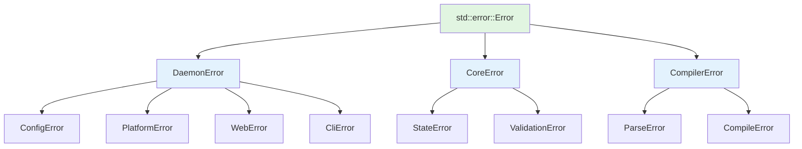
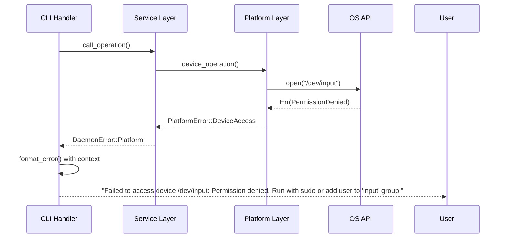

# Design Document - Error Handling Migration

## Overview

This design document outlines the technical approach for migrating keyrx2 from ad-hoc `unwrap()` usage to industry-standard error handling using `anyhow` and `thiserror`. The migration follows a phased approach, starting with high-priority modules and gradually expanding to cover the entire codebase.

**Key design decisions:**
- Use `anyhow` for application code (keyrx_daemon) where context-rich errors are needed
- Use `thiserror` for library code (keyrx_core, keyrx_compiler) where type-safe custom errors are needed
- Migrate in batches by module to minimize disruption
- Replace manual unwrap counting with clippy lints for automated enforcement

## Steering Document Alignment

### Technical Standards (tech.md)

**Error Handling Principles:**
- Fail fast: Validate at entry points, reject invalid input immediately
- Structured logging: Include error context in JSON format
- Custom exception hierarchy: Use `thiserror` for typed error enums
- Never log secrets/PII: Sanitize error messages

**Architecture Patterns:**
- Dependency Injection: Error types are injected through Result types
- SOLID principles: Each error type has single responsibility
- SSOT: Error definitions live close to the code they represent

### Project Structure (structure.md)

**File Organization:**
- Error types defined in dedicated `error.rs` modules per crate
- Shared error utilities in `keyrx_core/src/error.rs`
- CLI error formatting in `keyrx_daemon/src/cli/error.rs`
- Platform-specific errors in `keyrx_daemon/src/platform/error.rs`

## Code Reuse Analysis

### Existing Components to Leverage

**1. Existing error types:**
- `keyrx_daemon/src/error.rs`: Already defines `DaemonError` enum
- Pattern: Extend existing error types rather than replace them

**2. CLI common utilities:**
- `keyrx_daemon/src/cli/common.rs`: JSON output formatting
- Pattern: Add error formatting functions that integrate with existing output_error()

**3. Logging infrastructure:**
- Structured logging already uses JSON format
- Pattern: Integrate error context into existing log fields

### Integration Points

**1. Result type propagation:**
- Current: Many functions return `()` or panic on error
- Migration: Change return types to `Result<T, E>` with appropriate error types
- Integration: Use `?` operator to propagate errors up the call stack

**2. CLI error display:**
- Current: `output_error(message, code, json)` in cli/common.rs
- Migration: Add `impl From<DaemonError> for ErrorOutput` to format errors
- Integration: CLI handlers return `Result<(), DaemonError>` and errors are auto-formatted

**3. Web API error responses:**
- Current: Manual error status code handling in axum handlers
- Migration: Implement `IntoResponse` for error types
- Integration: Return `Result<Json<T>, DaemonError>` from handlers

## Architecture

### Error Type Hierarchy



### Error Propagation Flow



### Modular Design Principles

**Single File Responsibility:**
- `keyrx_daemon/src/error.rs`: Top-level error types only
- `keyrx_daemon/src/cli/error.rs`: CLI-specific error formatting
- `keyrx_daemon/src/platform/error.rs`: Platform error types
- `keyrx_daemon/src/config/error.rs`: Configuration error types

**Component Isolation:**
- Error types are self-contained with all context
- No circular dependencies between error types
- Each module owns its error definitions

**Service Layer Separation:**
- Business logic errors (validation, state) separate from infrastructure errors (IO, platform)
- Clear error conversion paths between layers

## Components and Interfaces

### Component 1: Core Error Infrastructure

**Purpose:** Provide base error types and utilities for the workspace

**File:** `keyrx_core/src/error.rs`

**Interfaces:**
```rust
/// Base error type for keyrx_core library
#[derive(Error, Debug)]
pub enum CoreError {
    #[error("Invalid state transition: {0}")]
    InvalidState(String),

    #[error("Validation failed: {0}")]
    Validation(String),

    #[error("Configuration error: {0}")]
    Config(String),
}

/// Result type alias for core operations
pub type CoreResult<T> = Result<T, CoreError>;
```

**Dependencies:** `thiserror`

**Reuses:** None (base component)

### Component 2: Daemon Error Types

**Purpose:** Define all daemon-level errors with rich context

**File:** `keyrx_daemon/src/error.rs`

**Interfaces:**
```rust
/// Top-level error type for keyrx_daemon
#[derive(Error, Debug)]
pub enum DaemonError {
    #[error("Configuration error: {0}")]
    Config(#[from] ConfigError),

    #[error("Platform error: {0}")]
    Platform(#[from] PlatformError),

    #[error("Web server error: {0}")]
    Web(#[from] WebError),

    #[error("CLI error: {0}")]
    Cli(#[from] CliError),

    #[error("Core error: {0}")]
    Core(#[from] CoreError),

    #[error("I/O error: {0}")]
    Io(#[from] std::io::Error),
}

/// Result type alias for daemon operations
pub type DaemonResult<T> = Result<T, DaemonError>;
```

**Dependencies:** `thiserror`, `keyrx_core`

**Reuses:** CoreError from keyrx_core

### Component 3: Configuration Error Types

**Purpose:** Handle configuration loading, parsing, and validation errors

**File:** `keyrx_daemon/src/config/error.rs`

**Interfaces:**
```rust
#[derive(Error, Debug)]
pub enum ConfigError {
    #[error("Configuration file not found: {path}")]
    FileNotFound { path: PathBuf },

    #[error("Failed to parse configuration: {source}")]
    ParseError {
        #[source]
        source: serde_json::Error,
    },

    #[error("Invalid profile: {name}. {reason}")]
    InvalidProfile { name: String, reason: String },

    #[error("Profile compilation failed: {0}")]
    CompilationFailed(String),
}
```

**Dependencies:** `thiserror`, `serde_json`

**Reuses:** Standard library path types

### Component 4: Platform Error Types

**Purpose:** Handle platform-specific operation errors

**File:** `keyrx_daemon/src/platform/error.rs`

**Interfaces:**
```rust
#[derive(Error, Debug)]
pub enum PlatformError {
    #[error("Failed to access device {device}: {reason}. {suggestion}")]
    DeviceAccess {
        device: String,
        reason: String,
        suggestion: String,
    },

    #[error("Keyboard injection failed: {0}")]
    InjectionFailed(String),

    #[error("Unsupported platform operation: {0}")]
    Unsupported(String),

    #[error("Platform initialization failed: {0}")]
    InitializationFailed(#[source] Box<dyn std::error::Error + Send + Sync>),
}
```

**Dependencies:** `thiserror`

**Reuses:** None

### Component 5: CLI Error Formatting

**Purpose:** Format errors for CLI output with colors and suggestions

**File:** `keyrx_daemon/src/cli/error.rs`

**Interfaces:**
```rust
/// Format error for CLI output
pub fn format_cli_error(error: &DaemonError, json: bool) -> String {
    if json {
        format_json_error(error)
    } else {
        format_human_error(error)
    }
}

/// Format error as JSON for programmatic consumption
fn format_json_error(error: &DaemonError) -> String {
    // Include error chain and suggestions
}

/// Format error for human-readable terminal output
fn format_human_error(error: &DaemonError) -> String {
    // Use colors, formatting, and actionable suggestions
}
```

**Dependencies:** `anyhow`, `colored`

**Reuses:** Existing `output_error()` function from `cli/common.rs`

### Component 6: Web Error Responses

**Purpose:** Convert errors to HTTP responses for web API

**File:** `keyrx_daemon/src/web/error.rs`

**Interfaces:**
```rust
/// Convert DaemonError to axum Response
impl IntoResponse for DaemonError {
    fn into_response(self) -> Response {
        let (status, error_message) = match self {
            DaemonError::Config(_) => (StatusCode::BAD_REQUEST, self.to_string()),
            DaemonError::Platform(_) => (StatusCode::INTERNAL_SERVER_ERROR, self.to_string()),
            DaemonError::Io(_) => (StatusCode::INTERNAL_SERVER_ERROR, "I/O error occurred".to_string()),
            // ... more mappings
        };

        (status, Json(json!({ "error": error_message }))).into_response()
    }
}
```

**Dependencies:** `axum`, `serde_json`

**Reuses:** DaemonError type

## Data Models

### Error Context Structure

```rust
/// Additional context that can be attached to errors
#[derive(Debug, Clone)]
pub struct ErrorContext {
    /// Operation that was being performed
    pub operation: String,

    /// File path related to the error (sanitized)
    pub file_path: Option<String>,

    /// Additional key-value context
    pub metadata: HashMap<String, String>,
}
```

### Migration Tracking

```rust
/// Track migration status of each module
#[derive(Debug)]
pub struct MigrationStatus {
    /// Module name
    pub module: String,

    /// Number of unwraps remaining
    pub unwraps_remaining: usize,

    /// Migration phase (not started, in progress, complete)
    pub phase: MigrationPhase,
}

#[derive(Debug)]
pub enum MigrationPhase {
    NotStarted,
    InProgress,
    Complete,
}
```

## Error Handling

### Error Scenarios

**1. Configuration File Not Found**
- **Handling:** Return `ConfigError::FileNotFound` with expected path
- **User Impact:** User sees: "Configuration file not found: /home/user/.config/keyrx/config.json. Create a configuration file or specify path with --config."

**2. Device Permission Denied**
- **Handling:** Return `PlatformError::DeviceAccess` with device path and suggestion
- **User Impact:** User sees: "Failed to access device /dev/input/event0: Permission denied. Run with sudo or add your user to the 'input' group: sudo usermod -aG input $USER"

**3. Profile Compilation Error**
- **Handling:** Return `ConfigError::CompilationFailed` with profile name and error details
- **User Impact:** User sees: "Profile compilation failed for 'my-profile': Invalid key code on line 45. Expected key code, got 'INVALID_KEY'."

**4. WebSocket Connection Failure**
- **Handling:** Return `WebError::ConnectionFailed` with connection details
- **User Impact:** User sees: "WebSocket connection failed: Connection refused. Is the daemon running? Check with 'systemctl status keyrx'."

**5. Invalid CLI Arguments**
- **Handling:** Return `CliError::InvalidArguments` with argument name and validation error
- **User Impact:** User sees: "Invalid argument '--count': Expected positive integer, got 'abc'."

## Testing Strategy

### Unit Testing

**Test approach:**
- Test each error type construction and formatting
- Verify error conversions using `#[from]` attribute
- Test error context propagation
- Validate error message content

**Key components to test:**
- Error type definitions compile correctly
- Error conversions work as expected
- Error messages contain expected information
- Error context is preserved through conversions

**Example test:**
```rust
#[test]
fn test_config_error_conversion() {
    let io_error = std::io::Error::new(std::io::ErrorKind::NotFound, "file not found");
    let daemon_error: DaemonError = ConfigError::from(io_error).into();

    assert!(matches!(daemon_error, DaemonError::Config(_)));
    assert!(daemon_error.to_string().contains("file not found"));
}
```

### Integration Testing

**Test approach:**
- Test error propagation through full call stack
- Verify CLI error output formatting (JSON and human-readable)
- Test web API error response status codes and bodies
- Validate error logging includes structured context

**Key flows to test:**
- CLI command → Service → Platform → OS (error propagates back up)
- Web request → Handler → Service → Config (error converted to HTTP response)
- Daemon startup → Config loading → Platform init (errors are logged properly)

**Example test:**
```rust
#[tokio::test]
async fn test_cli_error_formatting() {
    let error = DaemonError::Config(ConfigError::FileNotFound {
        path: PathBuf::from("/test/config.json"),
    });

    let output = format_cli_error(&error, false);
    assert!(output.contains("/test/config.json"));
    assert!(output.contains("Configuration file not found"));
}
```

### End-to-End Testing

**Test approach:**
- Run full daemon with intentionally broken configurations
- Verify error messages guide user to resolution
- Test error recovery scenarios
- Validate production error handling behavior

**User scenarios to test:**
1. **Missing config file:** Daemon fails to start with helpful error
2. **Invalid profile syntax:** CLI shows exact line and column of error
3. **Device permission denied:** Error suggests adding user to group
4. **Web API invalid request:** Returns 400 with clear error message
5. **Platform initialization failure:** Daemon exits gracefully with diagnostic info

## Migration Strategy

### Phase 1: Foundation (Week 1-2)

**Tasks:**
- Add anyhow and thiserror dependencies
- Define core error types in each crate
- Create error formatting utilities
- Update clippy lints to warn on unwrap_used

**Success criteria:**
- All crates compile with new dependencies
- Error types are defined and documented
- Clippy reports all existing unwraps

### Phase 2: High-Priority Modules (Week 3-4)

**Modules to migrate:**
- CLI handlers (40-50 unwraps)
- Configuration loading (30-40 unwraps)
- Profile management (20-30 unwraps)

**Approach:**
- Convert function return types to Result<T, E>
- Replace unwrap() with ? operator and context
- Add SAFETY comments for legitimate unwraps
- Update tests to expect Results

**Success criteria:**
- 100-120 unwraps eliminated
- CLI errors are user-friendly
- Configuration errors provide actionable feedback

### Phase 3: Platform Modules (Week 5-6)

**Modules to migrate:**
- Platform abstraction (20-30 unwraps)
- Linux platform implementation (40-50 unwraps)
- Windows platform implementation (30-40 unwraps)

**Approach:**
- Define platform-specific error types
- Propagate errors through platform trait
- Add error recovery for non-critical operations
- Ensure event loops don't panic

**Success criteria:**
- 90-120 unwraps eliminated
- Platform errors are descriptive
- Daemon doesn't crash on platform errors

### Phase 4: Web and Utilities (Week 7-8)

**Modules to migrate:**
- Web handlers (30-40 unwraps)
- WebSocket implementation (20-30 unwraps)
- Utility modules (20-30 unwraps)

**Approach:**
- Implement IntoResponse for errors
- Return proper HTTP status codes
- Add error logging in WebSocket handlers
- Propagate errors from utility functions

**Success criteria:**
- 70-100 unwraps eliminated
- Web API returns proper error responses
- Errors are logged with context

### Phase 5: Cleanup and Enforcement (Week 9+)

**Tasks:**
- Upgrade clippy unwrap_used from warn to deny
- Remove manual unwrap counting script
- Document error handling patterns
- Add error handling examples to docs

**Success criteria:**
- Clippy enforces no new unwraps
- Documentation includes error handling guide
- All unwraps are either eliminated or documented with SAFETY

## Performance Considerations

**Error construction overhead:**
- Use `thiserror` derive macro for zero-cost error types
- Avoid heap allocations in error paths where possible
- Use `&'static str` for error messages when context isn't needed

**Error propagation:**
- `?` operator has zero overhead (same as manual match)
- Error conversions through `#[from]` are optimized by compiler
- No performance impact on success paths

**Logging overhead:**
- Structured error logging uses lazy evaluation
- Error context only computed when error is actually logged
- Debug builds include full backtraces, release builds omit them

## Documentation Requirements

**Error type documentation:**
- Each error variant must have doc comment explaining when it occurs
- Include examples of how to handle each error type
- Document error conversion paths

**Migration guide:**
- Provide before/after examples for common patterns
- Document how to add SAFETY comments for legitimate unwraps
- Include troubleshooting guide for common migration issues

**API documentation:**
- Update function signatures to show Result types
- Document errors that functions can return
- Provide usage examples showing error handling
