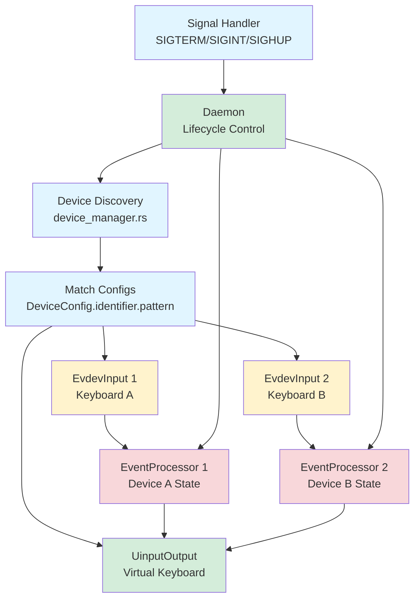

# Design Document

## Overview

The Linux evdev Integration spec implements real keyboard interception and injection on Linux, completing the transition from mock devices to production hardware interaction. This design builds on the platform abstraction layer from Phase 2, implementing the InputDevice and OutputDevice traits using Linux's evdev subsystem for input and uinput for output.

The architecture maintains the clean separation established in Phase 2:
1. **Platform Layer** (keyrx_daemon/platform/linux.rs): evdev/uinput implementations
2. **Daemon Layer** (keyrx_daemon): CLI, lifecycle management, device orchestration
3. **Core Layer** (keyrx_core/runtime): Unchanged event processing logic

This design enables running keyrx as a systemd service with proper signal handling, permission management via udev rules, and robust error recovery for production deployments.

## Steering Document Alignment

### Technical Standards (tech.md)

This implementation follows keyrx architectural patterns:

- **Trait-Based Platform Abstraction**: EvdevInput and UinputOutput implement existing traits
- **Zero-Copy Where Possible**: Direct evdev event reading without intermediate buffers
- **Structured Logging**: JSON format with daemon lifecycle events
- **Fail-Safe Defaults**: Release grabbed devices on any exit path
- **Explicit Error Handling**: All I/O operations return Result<T, E>

### Project Structure (structure.md)

File organization follows keyrx workspace conventions:

```
keyrx_daemon/
├── src/
│   ├── main.rs              # CLI entry point, argument parsing
│   ├── daemon.rs            # Lifecycle management, signal handling
│   ├── platform/
│   │   ├── mod.rs           # Trait definitions (existing)
│   │   ├── mock.rs          # Mock implementations (existing)
│   │   └── linux.rs         # NEW: evdev/uinput implementations
│   ├── device_manager.rs    # NEW: Device discovery and matching
│   ├── processor.rs         # Event processor (existing)
│   └── config_loader.rs     # Config loading (existing)
├── udev/
│   └── 99-keyrx.rules       # NEW: udev permission rules
├── systemd/
│   └── keyrx.service        # NEW: systemd service file
└── tests/
    └── linux_tests.rs       # NEW: Linux-specific integration tests
```

## Code Reuse Analysis

### Existing Components to Leverage

- **keyrx_daemon::platform::{InputDevice, OutputDevice}**: Traits already defined
  - EvdevInput implements InputDevice
  - UinputOutput implements OutputDevice
  - No changes needed to trait definitions

- **keyrx_daemon::processor::EventProcessor**: Unchanged orchestrator
  - Generic over InputDevice/OutputDevice
  - Works with new Linux implementations without modification

- **keyrx_core::runtime::{DeviceState, KeyLookup, process_event}**: Core logic unchanged
  - Event processing is platform-agnostic
  - Performance characteristics maintained

- **keyrx_compiler::serialize::deserialize**: Config loading unchanged
  - Same .krx format for all platforms

### Integration Points

- **evdev crate**: Rust bindings for Linux input subsystem
  - Device enumeration and capability detection
  - Event reading with proper timing
  - EVIOCGRAB ioctl for exclusive access

- **uinput crate** (or direct ioctl): Virtual device creation
  - Create virtual keyboard with full key set
  - Event injection with sync events
  - Clean device destruction

- **signal-hook crate**: Unix signal handling
  - SIGTERM/SIGINT for graceful shutdown
  - SIGHUP for config reload

- **nix crate**: Low-level Unix utilities
  - File descriptor operations
  - ioctl wrappers if needed

## Architecture

The daemon follows a multi-device event loop architecture:



### Modular Design Principles

- **Single File Responsibility**:
  - `linux.rs`: evdev/uinput implementations only
  - `device_manager.rs`: Device discovery and pattern matching only
  - `daemon.rs`: Lifecycle and signal handling only
  - `main.rs`: CLI parsing and entry point only

- **Component Isolation**:
  - Platform implementations have no knowledge of daemon lifecycle
  - Device manager is pure discovery (no event processing)
  - Processors are independent per device (no shared state)

- **Service Layer Separation**:
  - CLI layer: Argument parsing, help text
  - Orchestration layer: Daemon lifecycle, multi-device coordination
  - Platform layer: OS-specific I/O

## Components and Interfaces

### Component 1: EvdevInput (keyrx_daemon/src/platform/linux.rs)

**Purpose:** Read keyboard events from physical devices via evdev

**Interfaces:**
```rust
pub struct EvdevInput {
    device: evdev::Device,
    grabbed: bool,
}

impl EvdevInput {
    pub fn open(path: &Path) -> Result<Self, DeviceError>;
    pub fn from_device(device: evdev::Device) -> Self;
    pub fn name(&self) -> &str;
    pub fn serial(&self) -> Option<&str>;
    pub fn path(&self) -> &Path;
}

impl InputDevice for EvdevInput {
    fn next_event(&mut self) -> Result<KeyEvent, DeviceError>;
    fn grab(&mut self) -> Result<(), DeviceError>;
    fn release(&mut self) -> Result<(), DeviceError>;
}
```

**Dependencies:**
- `evdev` crate for device access
- `keyrx_core::runtime::event::KeyEvent` for event type
- `keyrx_daemon::platform::DeviceError` for error type

**Reuses:**
- InputDevice trait (existing)
- DeviceError enum (existing, may add variants)

**Design Decisions:**
- **evdev crate**: Well-maintained Rust bindings, handles ioctl complexity
- **Blocking reads**: Simplest model, one thread per device or async later
- **Key repeat handling**: Ignore value=2 (repeat) events, only process press/release
- **Error mapping**: Convert evdev errors to DeviceError variants

### Component 2: UinputOutput (keyrx_daemon/src/platform/linux.rs)

**Purpose:** Inject keyboard events via uinput virtual device

**Interfaces:**
```rust
pub struct UinputOutput {
    device: uinput::Device,  // or raw fd with helper functions
}

impl UinputOutput {
    pub fn create(name: &str) -> Result<Self, DeviceError>;
}

impl OutputDevice for UinputOutput {
    fn inject_event(&mut self, event: KeyEvent) -> Result<(), DeviceError>;
}
```

**Dependencies:**
- `uinput` crate or direct ioctl via `nix`
- `keyrx_core::runtime::event::KeyEvent` for event type

**Reuses:**
- OutputDevice trait (existing)

**Design Decisions:**
- **Single virtual device**: All output goes through one virtual keyboard (simpler)
- **Full key capability**: Register all possible key codes at creation
- **SYN_REPORT after each key**: Ensure events are processed immediately
- **Device name**: "keyrx virtual keyboard" for easy identification

### Component 3: DeviceManager (keyrx_daemon/src/device_manager.rs)

**Purpose:** Discover input devices and match to configurations

**Interfaces:**
```rust
pub struct DeviceManager {
    devices: Vec<ManagedDevice>,
}

pub struct ManagedDevice {
    pub input: EvdevInput,
    pub config: DeviceConfig,
    pub processor: EventProcessor<EvdevInput, SharedOutput>,
}

impl DeviceManager {
    pub fn discover(configs: &[DeviceConfig]) -> Result<Self, DiscoveryError>;
    pub fn refresh(&mut self) -> Result<(), DiscoveryError>;
    pub fn devices(&self) -> &[ManagedDevice];
}

pub fn enumerate_keyboards() -> Result<Vec<evdev::Device>, DeviceError>;
pub fn match_device(device: &evdev::Device, pattern: &str) -> bool;
```

**Dependencies:**
- `evdev` for device enumeration
- `keyrx_core::config::DeviceConfig` for pattern matching
- `EvdevInput` for wrapped devices

**Design Decisions:**
- **Glob pattern matching**: Support `"*"` and `"USB\\VID_*"` patterns
- **Priority ordering**: Specific patterns before wildcard
- **Hot-plug awareness**: refresh() can detect newly connected devices
- **Shared output**: All devices share single UinputOutput

### Component 4: Daemon (keyrx_daemon/src/daemon.rs)

**Purpose:** Manage daemon lifecycle, signal handling, event loop

**Interfaces:**
```rust
pub struct Daemon {
    config_path: PathBuf,
    device_manager: DeviceManager,
    output: UinputOutput,
    running: Arc<AtomicBool>,
}

impl Daemon {
    pub fn new(config_path: &Path) -> Result<Self, DaemonError>;
    pub fn run(&mut self) -> Result<(), DaemonError>;
    pub fn reload(&mut self) -> Result<(), DaemonError>;
    pub fn shutdown(&mut self);
}

pub fn install_signal_handlers(running: Arc<AtomicBool>) -> Result<(), io::Error>;
```

**Dependencies:**
- `signal-hook` for signal handling
- `DeviceManager` for device orchestration
- `EventProcessor` for event processing
- `UinputOutput` for event injection

**Design Decisions:**
- **AtomicBool for shutdown**: Simple thread-safe shutdown flag
- **Blocking event loop**: One event per iteration, check shutdown flag
- **Multi-device iteration**: Poll all devices, process events as available
- **Reload on SIGHUP**: Reload config without restarting daemon

### Component 5: CLI (keyrx_daemon/src/main.rs)

**Purpose:** Parse arguments, dispatch subcommands

**Interfaces:**
```rust
#[derive(Parser)]
struct Cli {
    #[command(subcommand)]
    command: Commands,
}

#[derive(Subcommand)]
enum Commands {
    Run {
        #[arg(short, long)]
        config: PathBuf,
        #[arg(long)]
        debug: bool,
    },
    ListDevices,
    Validate {
        #[arg(short, long)]
        config: PathBuf,
    },
}
```

**Dependencies:**
- `clap` for argument parsing
- `Daemon` for run command
- `enumerate_keyboards` for list-devices command

**Design Decisions:**
- **Subcommand structure**: Matches keyrx_compiler pattern
- **run subcommand**: Main daemon mode
- **list-devices subcommand**: Helper for configuration
- **validate subcommand**: Dry-run to check config and device matching

## Data Models

### KeyCode Mapping Table
```rust
/// Map evdev event codes to KeyCode enum
pub fn evdev_to_keycode(code: u16) -> Option<KeyCode> {
    match code {
        evdev::KEY_A => Some(KeyCode::A),
        evdev::KEY_B => Some(KeyCode::B),
        // ... all keys
        evdev::KEY_LEFTSHIFT => Some(KeyCode::LShift),
        evdev::KEY_RIGHTSHIFT => Some(KeyCode::RShift),
        // ...
        _ => None,  // Unknown key, passthrough as-is?
    }
}

/// Map KeyCode enum to evdev event codes
pub fn keycode_to_evdev(keycode: KeyCode) -> u16 {
    match keycode {
        KeyCode::A => evdev::KEY_A,
        KeyCode::B => evdev::KEY_B,
        // ...
    }
}
```

### ManagedDevice
```rust
pub struct ManagedDevice {
    pub input: EvdevInput,
    pub config: DeviceConfig,
    pub state: DeviceState,
    pub lookup: KeyLookup,
}
```
- **Purpose**: Bundle device with its configuration and runtime state
- **Properties**:
  - input: Platform-specific input device
  - config: Configuration from .krx file
  - state: 255-bit modifier/lock vectors
  - lookup: HashMap-based key→mapping resolution

### DaemonError
```rust
#[derive(Debug, thiserror::Error)]
pub enum DaemonError {
    #[error("Configuration error: {0}")]
    Config(#[from] ConfigError),
    #[error("Device error: {0}")]
    Device(#[from] DeviceError),
    #[error("No matching devices found")]
    NoDevices,
    #[error("Signal handling error: {0}")]
    Signal(#[from] io::Error),
}
```

## Error Handling

### Error Scenarios

#### 1. Permission Denied on evdev Device
**Scenario:** User not in `input` group, cannot read /dev/input/event*

**Handling:**
```rust
match EvdevInput::open(path) {
    Ok(device) => { /* proceed */ },
    Err(DeviceError::PermissionDenied(msg)) => {
        eprintln!("Permission denied: {}", msg);
        eprintln!("");
        eprintln!("To fix, add your user to the 'input' group:");
        eprintln!("  sudo usermod -aG input $USER");
        eprintln!("");
        eprintln!("Then log out and back in, or run:");
        eprintln!("  newgrp input");
        std::process::exit(2);
    },
    Err(e) => return Err(e.into()),
}
```

**User Impact:** Clear instructions for fixing permission issue

#### 2. uinput Device Creation Fails
**Scenario:** /dev/uinput not accessible

**Handling:**
```rust
match UinputOutput::create("keyrx virtual keyboard") {
    Ok(output) => { /* proceed */ },
    Err(DeviceError::PermissionDenied(msg)) => {
        eprintln!("Cannot create virtual keyboard: {}", msg);
        eprintln!("");
        eprintln!("To fix, install udev rules:");
        eprintln!("  sudo cp /usr/share/keyrx/udev/99-keyrx.rules /etc/udev/rules.d/");
        eprintln!("  sudo udevadm control --reload-rules");
        eprintln!("  sudo udevadm trigger");
        eprintln!("");
        eprintln!("Then add your user to the 'uinput' group:");
        eprintln!("  sudo groupadd -f uinput");
        eprintln!("  sudo usermod -aG uinput $USER");
        std::process::exit(2);
    },
    Err(e) => return Err(e.into()),
}
```

**User Impact:** Step-by-step udev rule installation

#### 3. Device Disconnected During Operation
**Scenario:** USB keyboard unplugged while daemon running

**Handling:**
```rust
match input.next_event() {
    Ok(event) => { /* process */ },
    Err(DeviceError::Io(e)) if e.kind() == io::ErrorKind::BrokenPipe => {
        log::warn!("Device disconnected: {}", device.name());
        // Remove from active devices, continue with others
        device_manager.remove_device(device_id);
        if device_manager.is_empty() {
            log::info!("No devices remaining, entering discovery mode");
            // Poll for reconnection
        }
    },
    Err(e) => log::error!("Read error: {}", e),
}
```

**User Impact:** Continues with remaining devices, waits for reconnection

#### 4. No Matching Devices Found
**Scenario:** Config pattern doesn't match any connected device

**Handling:**
```rust
if device_manager.devices().is_empty() {
    eprintln!("No matching devices found for configuration patterns.");
    eprintln!("");
    eprintln!("Available devices:");
    for device in enumerate_keyboards()? {
        eprintln!("  {} ({})", device.name(), device.serial().unwrap_or("no serial"));
    }
    eprintln!("");
    eprintln!("Config patterns:");
    for config in &configs {
        eprintln!("  {}", config.identifier.pattern);
    }
    std::process::exit(1);
}
```

**User Impact:** Shows available devices to help fix pattern

#### 5. Signal Received (SIGTERM/SIGINT)
**Scenario:** User presses Ctrl+C or service stopped

**Handling:**
```rust
// In main loop
while running.load(Ordering::Relaxed) {
    // Process events...
}

// Cleanup
log::info!("Shutdown signal received, cleaning up...");
for device in device_manager.devices_mut() {
    if let Err(e) = device.input.release() {
        log::warn!("Failed to release device {}: {}", device.name(), e);
    }
}
output.destroy()?;
log::info!("Daemon stopped");
```

**User Impact:** Clean exit, devices released back to system

## Testing Strategy

### Unit Testing

**Approach:** Test Linux-specific code in isolation where possible

**Key Components to Test:**

1. **KeyCode Mapping (linux.rs)**
   - Test evdev_to_keycode for all keys
   - Test keycode_to_evdev round-trip
   - Test unknown key handling

2. **Pattern Matching (device_manager.rs)**
   - Test wildcard pattern `"*"`
   - Test prefix patterns `"USB\\VID_*"`
   - Test exact match patterns
   - Test no-match case

3. **Error Construction**
   - Test DeviceError variants have correct messages
   - Test DaemonError Display implementation

### Integration Testing

**Approach:** Use mock evdev/uinput where possible, real devices in CI if available

**Key Flows to Test:**

1. **Device Discovery Flow**
   ```rust
   #[test]
   fn test_device_discovery_with_pattern() {
       // Create mock device list
       // Match against pattern
       // Verify correct devices selected
   }
   ```

2. **Event Processing Flow**
   ```rust
   #[test]
   fn test_evdev_to_keyevent_conversion() {
       // Create evdev event
       // Convert to KeyEvent
       // Verify correct type and keycode
   }
   ```

3. **Signal Handling Flow**
   ```rust
   #[test]
   fn test_sigterm_causes_graceful_shutdown() {
       // Start daemon in thread
       // Send SIGTERM
       // Verify clean exit
   }
   ```

### End-to-End Testing

**Approach:** Run daemon with real devices (requires hardware or VM)

**User Scenarios:**

1. **Basic Remapping**
   - Config: A→B
   - Action: Press physical A key
   - Verify: B character appears in text input

2. **CapsLock to Escape**
   - Config: CapsLock→VK_Escape
   - Action: Press CapsLock in vim
   - Verify: Enters normal mode

3. **Vim Navigation Layer**
   - Config: CapsLock→MD_00, when(MD_00) { H→Left, J→Down, K→Up, L→Right }
   - Action: Hold CapsLock, press HJKL
   - Verify: Cursor moves in text

4. **Multi-Device**
   - Config: Device A uses config 1, Device B uses config 2
   - Action: Type on both keyboards
   - Verify: Different mappings applied correctly

5. **Hot-Plug**
   - Action: Start daemon, unplug keyboard, plug back in
   - Verify: Daemon recovers and continues remapping

### Performance Testing

**Benchmarks:**

1. **Event Latency**
   - Measure time from evdev read to uinput write
   - Target: <1ms end-to-end

2. **Device Discovery**
   - Measure time to enumerate and match devices
   - Target: <100ms for 10 devices

3. **Memory Usage**
   - Measure RSS with varying device counts
   - Target: <50MB with 5 devices

4. **CPU Usage**
   - Measure CPU under typing load (100 WPM)
   - Target: <5% of single core
