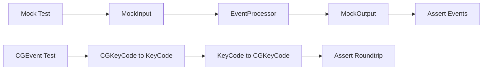
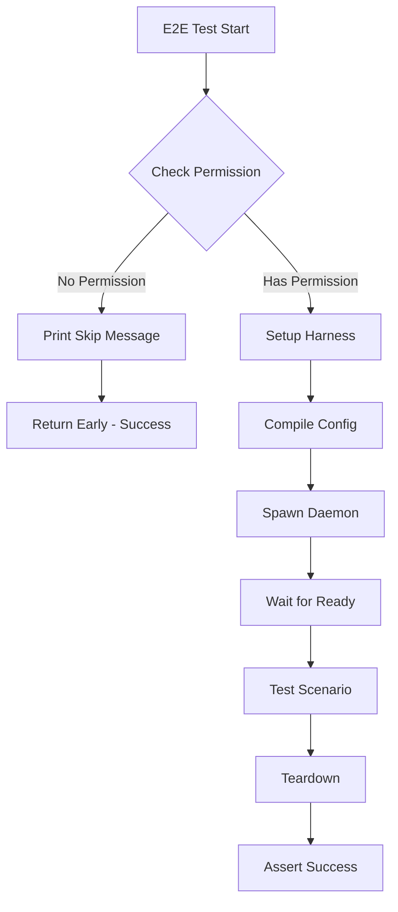

# Design Document

## Overview

This design implements a three-layer testing strategy for macOS platform support, addressing the fundamental constraint that Accessibility permissions prevent automated E2E testing in CI environments. The solution maximizes test coverage while maintaining CI reliability by:

1. **Layer 1**: Enhanced mock tests running in CI without permissions
2. **Layer 2**: E2E tests with permission checks auto-skipping in CI
3. **Layer 3**: Test runner script orchestrating the full suite

The design follows the existing test patterns from Linux (e2e_linux_multidevice.rs) and Windows (e2e_windows_basic.rs, E2EHarness) while adapting to macOS's permission model.

## Steering Document Alignment

### Technical Standards (tech.md)

**Language & Build System**:
- Pure Rust implementation (no external scripts or dependencies beyond test utilities)
- Integration with existing cargo test infrastructure
- Follows existing test module organization (`keyrx_daemon/tests/`)

**Testing Philosophy**:
- Property-based testing for conversion correctness (CGEvent ↔ KeyCode)
- Deterministic test execution (no flaky tests)
- Fast feedback loop (<10s for mock tests)
- Reuses existing test utilities: `MockInput`, `MockOutput`, `VirtualKeyboard`, `OutputCapture`

**Dependency Management**:
- No new dependencies for Layer 1 (mocks)
- Reuses `serial_test` crate for E2E test serialization
- Uses existing `keyrx_core::runtime::KeyEvent` types

### Project Structure (structure.md)

**Test Organization**:
```
keyrx_daemon/tests/
├── macos_integration.rs          # Existing (430 lines, Layer 1 foundation)
├── macos_mock_tests.rs           # NEW (Layer 1: enhanced mocks)
├── e2e_macos_harness.rs          # NEW (Layer 2: macOS E2E harness)
├── e2e_macos_basic.rs            # NEW (Layer 2: basic E2E tests)
├── e2e_macos_multidevice.rs      # NEW (Layer 2: multi-device E2E tests)
└── ...
```

**Script Organization**:
```
scripts/
├── test_macos_full.sh            # NEW (Layer 3: complete test runner)
├── check_macos_permission.sh     # NEW (Layer 3: permission checker)
└── ...
```

## Code Reuse Analysis

### Existing Components to Leverage

#### Test Infrastructure
- **`e2e_harness.rs`**: Base E2E harness pattern for spawning daemon, config compilation
  - Reuse: `E2EError`, `E2EConfig` patterns for macOS harness
  - Adapt: `VirtualKeyboard` not available on macOS (no uinput equivalent)

- **`macos_integration.rs`**: Existing 430-line integration test suite
  - Reuse: `MockInput`/`MockOutput` pattern for all Layer 1 tests
  - Extend: Add CGEvent conversion tests, IOKit device discovery tests

- **`platform/macos/permissions.rs`**: Existing permission checking
  - Reuse: `check_accessibility_permission()` for E2E test skipping
  - Reuse: `get_permission_error_message()` for informative skip messages

#### Core Components
- **`keyrx_core::config::KeyCode`**: Cross-platform key representation
- **`keyrx_core::runtime::KeyEvent`**: Event type for test assertions
- **`keyrx_compiler::serialize`**: Config compilation for E2E tests

### Integration Points

#### Existing Test Utilities
- **`keyrx_daemon::test_utils::MockInput`**: Inject synthetic events (Layer 1)
- **`keyrx_daemon::test_utils::MockOutput`**: Capture output events (Layer 1)
- **`keyrx_daemon::processor::EventProcessor`**: Process events in tests (Layer 1)
- **`keyrx_daemon::test_utils::VirtualKeyboard`**: Not available on macOS (Linux-only)

#### Platform Code
- **`platform/macos/mod.rs`**: `MacosPlatform` trait implementation (test target)
- **`platform/macos/keycode_map.rs`**: CGKeyCode ↔ KeyCode conversion (test target)
- **`platform/macos/device_discovery.rs`**: IOKit device enumeration (test target)

## Architecture

### Layer 1: Enhanced Mock Tests

**Purpose**: Maximize code coverage without requiring Accessibility permissions



**Key Components**:
1. **CGEvent Conversion Tests**: Validate bidirectional conversion without capturing real events
2. **Platform Initialization Tests**: Test permission checking logic without actual permissions
3. **Device Discovery Tests**: Mock IOKit responses for enumeration edge cases

**Test Coverage Goals**:
- All keycode_map functions (±140 key codes)
- Permission checking error paths
- Device discovery edge cases (0 devices, 10 devices, invalid serials)
- Platform trait error handling

### Layer 2: E2E Tests with Permission Checks

**Purpose**: Validate end-to-end behavior with real hardware when developer has permissions



**Components**:

1. **MacosE2EHarness** (new file: `e2e_macos_harness.rs`)
   - Similar structure to `e2e_harness.rs`
   - Spawns `keyrx_daemon` subprocess with compiled .krx config
   - Captures stdout/stderr for debugging
   - Graceful shutdown (SIGTERM → wait 5s → SIGKILL)

2. **Permission Gating** (per-test basis)
   ```rust
   #[test]
   fn test_macos_e2e_basic_remap() {
       if !check_accessibility_permission() {
           eprintln!("⚠️  Skipping E2E: Accessibility permission required");
           eprintln!("   Enable in: System Settings > Privacy & Security > Accessibility");
           return;  // Success exit, not failure
       }
       // ... actual test
   }
   ```

3. **Test Scenarios** (matching Linux/Windows):
   - Basic remap (A → B)
   - Multi-device discrimination (USB keyboard vs builtin)
   - Tap-hold timing verification
   - Modifier state handling (Cmd, Option)

**Key Difference from Linux/Windows**:
- **No VirtualKeyboard**: macOS has no uinput equivalent for creating virtual devices
- **Real keyboard required**: E2E tests must use physical keyboard (developer machine only)
- **Auto-skip in CI**: Tests automatically skip without failing

### Layer 3: Automated Test Runner Script

**Purpose**: Orchestrate full test suite with clear progress reporting

```bash
#!/usr/bin/env bash
# scripts/test_macos_full.sh

set -euo pipefail

echo "🧪 macOS Testing Suite"
echo ""

# Phase 1: Mock tests (always run)
echo "▶ Running integration tests (no permissions needed)..."
cargo test -p keyrx_daemon --test macos_integration --test macos_mock_tests --features macos

# Phase 2: Permission check (non-blocking)
echo ""
echo "▶ Checking Accessibility permission..."
if ./scripts/check_macos_permission.sh; then
    echo "✅ Permission granted - running E2E tests"
    cargo test -p keyrx_daemon --test e2e_macos_basic --test e2e_macos_multidevice --features macos
else
    echo "⚠️  No Accessibility permission - skipping E2E tests"
    echo "   Enable in: System Settings > Privacy & Security > Accessibility"
fi

# Phase 3: Benchmarks (always run)
echo ""
echo "▶ Running latency benchmarks..."
cargo bench -p keyrx_daemon macos_latency --features macos

# Phase 4: Manual test prompt (interactive only)
if [ -t 0 ]; then
    echo ""
    read -p "Run interactive manual tests? (y/N) " -n 1 -r
    echo
    if [[ $REPLY =~ ^[Yy]$ ]]; then
        echo "Manual testing not implemented yet"
        # Future: ./scripts/macos_manual_test.sh
    fi
fi

echo ""
echo "✅ macOS test suite complete"
```

**Permission Checker Script**:
```bash
#!/usr/bin/env bash
# scripts/check_macos_permission.sh

# Build minimal test binary
cargo build -p keyrx_daemon --example check_permission --features macos 2>/dev/null

# Run and check exit code
./target/debug/examples/check_permission
exit $?
```

**Exit Code Contract**:
- `0`: Success (all tests passed, or E2E appropriately skipped)
- `1`: Failure (mock tests failed, or E2E tests ran but failed)
- `2`: Environment error (build failed, can't compile)

## Components and Interfaces

### Component 1: MacosE2EHarness

- **Purpose**: Orchestrate E2E test lifecycle (setup, config compilation, daemon spawning, teardown)
- **Interfaces**:
  ```rust
  impl MacosE2EHarness {
      pub fn setup(config: E2EConfig) -> Result<Self, E2EError>;
      pub fn wait_for_ready(&self, timeout: Duration) -> Result<(), E2EError>;
      pub fn teardown(self) -> Result<TeardownResult, E2EError>;
  }
  ```
- **Dependencies**:
  - `keyrx_compiler::serialize` (config compilation)
  - `std::process::Command` (daemon spawning)
  - `tempfile` (temp config files)
- **Reuses**: `E2EError`, `E2EConfig` patterns from `e2e_harness.rs`

**Key Design Decision**: No event injection/capture abstraction
- Linux has `VirtualKeyboard` + `OutputCapture` for synthetic events
- macOS has no virtual device API → must use real keyboard
- E2E tests validate process spawning + config loading, not full input/output pipeline
- Manual testing checklist covers full input/output validation

### Component 2: Enhanced Mock Test Suite

- **Purpose**: Test platform logic without Accessibility permissions
- **Interfaces**: Standard Rust `#[test]` functions
- **Dependencies**:
  - `keyrx_daemon::platform::MockInput`
  - `keyrx_daemon::platform::MockOutput`
  - `keyrx_daemon::processor::EventProcessor`
- **Reuses**: Existing `macos_integration.rs` test patterns

**Test Categories**:
1. **Keycode Conversion**: Round-trip CGKeyCode ↔ KeyCode for all 140+ keys
2. **Platform Initialization**: Permission denied → graceful error
3. **Device Discovery**: IOKit enumeration edge cases
4. **Cross-Platform Parity**: Same config produces same output as Linux/Windows

### Component 3: Test Runner Scripts

- **Purpose**: Provide unified entry point for full test suite
- **Interfaces**:
  - `test_macos_full.sh`: Main runner (exit code 0 = success)
  - `check_macos_permission.sh`: Permission checker (exit code 0 = granted)
- **Dependencies**:
  - `cargo test` (run tests)
  - `cargo bench` (run benchmarks)
  - `bash` (script runtime)
- **Reuses**: Existing `scripts/` directory conventions

## Data Models

### E2EConfig (Reused from e2e_harness.rs)

```rust
pub struct E2EConfig {
    pub config_root: ConfigRoot,
}

impl E2EConfig {
    pub fn simple_remap(from: KeyCode, to: KeyCode) -> Self;
    pub fn custom(config_root: ConfigRoot) -> Self;
}
```

### MacosE2EHarness

```rust
pub struct MacosE2EHarness {
    daemon_process: Child,
    config_path: PathBuf,
    _temp_dir: TempDir,  // Cleanup on drop
}
```

### TeardownResult (Reused from e2e_harness.rs)

```rust
pub struct TeardownResult {
    pub graceful_shutdown: bool,
    pub sigkill_sent: bool,
    pub exit_code: Option<i32>,
}
```

## Error Handling

### Error Scenarios

1. **E2E Test Without Permission (Not an Error)**
   - **Handling**: Test returns early with success
   - **User Impact**: Test output shows skip message with instructions

2. **Mock Test Failure**
   - **Handling**: Test panics with assertion failure
   - **User Impact**: CI fails, developer sees diff of expected vs actual

3. **Daemon Spawn Failure**
   - **Handling**: Return `E2EError::DaemonStartError` with stderr output
   - **User Impact**: Test fails with daemon logs for debugging

4. **Daemon Crash During Test**
   - **Handling**: Detect exit code in harness, return `E2EError::DaemonCrashed`
   - **User Impact**: Test fails with exit code and crash logs

5. **Test Runner Script Interruption (Ctrl+C)**
   - **Handling**: Bash `trap` handler kills all spawned processes
   - **User Impact**: Clean exit, no orphaned daemon processes

## Testing Strategy

### Unit Testing (Layer 1)

**Approach**: Use mock input/output for all platform logic tests

**Key Components to Test**:
- `keycode_map::cg_to_keycode()` - All 140+ mappings
- `keycode_map::keycode_to_cg()` - Reverse mappings
- `permissions::check_accessibility_permission()` - Returns bool
- `device_discovery::enumerate_devices()` - Edge cases with mock IOKit

**Coverage Goal**: ≥90% line coverage of `platform/macos/` modules

### Integration Testing (Layer 1 + Layer 2)

**Approach**:
- Layer 1: Mock-based end-to-end via `EventProcessor`
- Layer 2: Real daemon subprocess with permission gating

**Key Flows to Test**:

**Layer 1 (Mock-based)**:
- Basic remap: A → B
- Modifier remap: Cmd → Ctrl
- Layer switching: CapsLock + HJKL → Arrows
- Passthrough: Unmapped keys unchanged
- Cross-platform parity: Same config = same output

**Layer 2 (Real daemon, permission-gated)**:
- Daemon starts without errors
- Config loads successfully
- Graceful shutdown works
- (Future: Full input/output pipeline with manual verification)

### End-to-End Testing (Layer 2)

**Approach**: Spawn real daemon as subprocess, validate startup/shutdown

**User Scenarios to Test**:
- Developer with permissions: All E2E tests run
- Developer without permissions: E2E tests skip with helpful message
- CI environment: E2E tests skip silently (exit 0)

**Test Invariants**:
- Daemon process never orphaned (always killed in teardown)
- Test files cleaned up even on panic (via `Drop` on `TempDir`)
- Exit codes always meaningful (0 = success, 1 = test failure, 2 = env error)

## Implementation Phases

### Phase 1: Layer 1 (Enhanced Mock Tests)
1. Create `macos_mock_tests.rs` with CGEvent conversion tests
2. Add platform initialization tests (permission denied path)
3. Add device discovery tests (mock IOKit responses)
4. Achieve ≥90% coverage of `platform/macos/` modules

### Phase 2: Layer 2 (E2E Tests)
1. Create `e2e_macos_harness.rs` (modeled after `e2e_harness.rs`)
2. Implement permission checking at test level (not harness level)
3. Create `e2e_macos_basic.rs` with basic daemon spawn test
4. Create `e2e_macos_multidevice.rs` with device discrimination test
5. Verify tests auto-skip in CI environment

### Phase 3: Layer 3 (Test Runner)
1. Create `check_macos_permission.sh` helper script
2. Create `test_macos_full.sh` main runner script
3. Add permission check with non-blocking behavior
4. Add benchmark execution
5. Add interactive manual test prompt
6. Test in both interactive and CI modes

## Performance Considerations

**Mock Tests**:
- Target: <10 seconds total runtime
- Strategy: Parallel test execution (default for `cargo test`)
- No I/O operations (pure in-memory)

**E2E Tests**:
- Target: <60 seconds per test
- Strategy: Serial execution (via `#[serial]` attribute)
- 5-second daemon shutdown timeout (SIGTERM → SIGKILL)

**Benchmarks**:
- Maintain existing latency benchmark (1000 iterations)
- Target: <30 seconds total runtime

## Security Considerations

**Permission Handling**:
- Never prompt user for permission (macOS handles this)
- Never attempt to bypass permission checks
- Clear documentation when permission required

**Process Management**:
- Always kill spawned daemon processes (no zombies)
- Use SIGTERM first (graceful), SIGKILL as fallback
- Timeout prevents infinite hangs (5s)

## Deployment

**CI Integration**:
```yaml
# .github/workflows/ci.yml (existing file, add macOS job)
test-macos:
  runs-on: macos-latest
  steps:
    - uses: actions/checkout@v3
    - uses: actions-rs/toolchain@v1
    - name: Run macOS test suite
      run: ./scripts/test_macos_full.sh
```

**Developer Workflow**:
```bash
# Before pushing changes
./scripts/test_macos_full.sh

# If E2E tests are skipped, grant permission:
# 1. Open System Settings
# 2. Privacy & Security > Accessibility
# 3. Enable Terminal (or your IDE)
# 4. Re-run: ./scripts/test_macos_full.sh
```

**Release Checklist**:
- All mock tests pass (CI)
- E2E tests run successfully on at least one developer machine
- Latency benchmarks meet <1ms requirement
- Manual testing checklist completed (if available)
