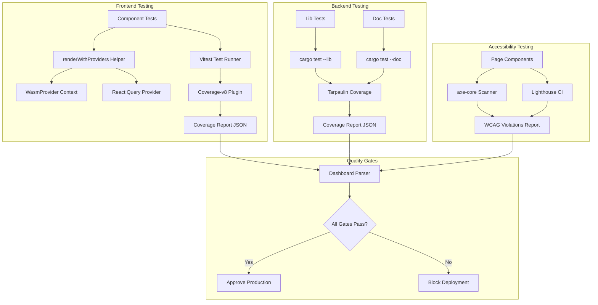

# Design Document

## Overview

This design addresses production readiness blockers discovered during pre-production verification of the keyrx-ui-ux-refinement implementation. The primary focus is fixing test failures, implementing coverage verification, conducting accessibility audits, and resolving backend doc test compilation issues.

**Core Strategy:**
1. Fix test infrastructure to wrap context-dependent components (MonacoEditor)
2. Install and configure coverage tooling (@vitest/coverage-v8)
3. Integrate accessibility testing (axe-core, Lighthouse CI)
4. Resolve backend crate version conflicts

This remediation follows a **quality gate enforcement** pattern: automated verification prevents production deployment until all standards are met.

## Steering Document Alignment

### Technical Standards (tech.md)

**Code Quality Enforcement (KPI):**
- Enforces 80% minimum test coverage requirement
- Validates WCAG 2.2 Level AA compliance (accessibility standard)
- Pre-commit hook integration for automated verification

**Architecture Patterns:**
- **Dependency Injection**: Test helpers inject WasmProvider context
- **SOLID Principles**: Each test utility has single responsibility (e.g., renderWithProviders only handles provider setup)
- **Structured Logging**: Test results in JSON format for CI/CD parsing

**Error Handling:**
- Fail fast: Tests fail immediately on assertion errors
- Structured test output: JSON reports for coverage and accessibility
- Clear error messages: Test failures include actionable fix guidance

### Project Structure (structure.md)

**Frontend Test Location:**
- Unit tests: `keyrx_ui/tests/` (shared utilities)
- Component tests: `keyrx_ui/src/components/*.test.tsx`
- Integration tests: `keyrx_ui/tests/integration/`

**Backend Test Location:**
- Library tests: `keyrx_daemon/src/**/*_test.rs`
- Doc tests: Inline in source files with `/// # Examples`
- Integration tests: `keyrx_daemon/tests/`

**Coverage Reports:**
- Frontend: `keyrx_ui/coverage/` (HTML + JSON)
- Backend: `target/tarpaulin/` (HTML + JSON)

## Code Reuse Analysis

### Existing Components to Leverage

**Frontend Testing Infrastructure:**
- **Vitest**: Already configured in `keyrx_ui/vite.config.ts`
- **React Testing Library**: Used in existing tests (`useAutoSave.test.tsx`)
- **WasmContext**: Existing context provider in `keyrx_ui/src/contexts/WasmContext.tsx`

**Backend Testing Infrastructure:**
- **Cargo test**: Workspace-level test execution
- **Tarpaulin**: Code coverage tool (already in Makefile)
- **Doc tests**: Existing pattern in keyrx_core modules

**Accessibility Tools (New):**
- **axe-core**: Industry-standard WCAG validator
- **Lighthouse CI**: Automated performance and accessibility audits
- **jest-axe**: Vitest-compatible accessibility assertions

### Integration Points

**Test Utilities Integration:**
- Extend existing `keyrx_ui/tests/testUtils.tsx` with WasmProviderWrapper
- Add `renderWithProviders` helper for context injection

**CI/CD Integration:**
- Extend `.github/workflows/ci.yml` with coverage gates
- Add accessibility audit step to CI pipeline
- Fail builds on coverage <80% or accessibility violations

**Coverage Reporting:**
- Frontend: Vitest coverage-v8 plugin outputs to coverage/
- Backend: Tarpaulin outputs to target/tarpaulin/
- Both generate JSON for dashboard consumption

## Architecture

### Test Infrastructure Architecture



### Modular Design Principles

**Test Helper Modularity:**
- **Single File Responsibility**: `WasmProviderWrapper.tsx` only handles WASM context injection
- **Component Isolation**: Each test file tests one component in isolation
- **Service Layer Separation**: Test data factories separate from test logic
- **Utility Modularity**: Coverage reporters separate from test runners

**File Organization:**
```
keyrx_ui/
├── tests/
│   ├── testUtils.tsx           # Shared test helpers (renderWithProviders)
│   ├── WasmProviderWrapper.tsx # WASM context injection utility
│   ├── AccessibilityTestHelper.tsx # Accessibility test utilities
│   └── integration/            # Integration test suites
├── coverage/                   # Generated coverage reports (gitignored)
└── lighthouse/                 # Lighthouse CI reports (gitignored)
```

## Components and Interfaces

### Component 1: WasmProviderWrapper (Frontend)

- **Purpose:** Inject WasmProvider context into test components
- **Interfaces:**
  ```typescript
  export function WasmProviderWrapper({ children }: { children: ReactNode }): JSX.Element
  ```
- **Dependencies:**
  - `keyrx_ui/src/contexts/WasmContext.tsx` (existing)
  - React 18+
- **Reuses:** Existing WasmProvider from production code

### Component 2: renderWithProviders Helper (Frontend)

- **Purpose:** Wrap components with all necessary providers for testing
- **Interfaces:**
  ```typescript
  export function renderWithProviders(
    ui: ReactElement,
    options?: {
      wrapWithWasm?: boolean;
      wrapWithReactQuery?: boolean;
      initialState?: Partial<AppState>;
    }
  ): RenderResult
  ```
- **Dependencies:**
  - `@testing-library/react`
  - `WasmProviderWrapper`
  - `React Query QueryClientProvider`
- **Reuses:** Extends existing testUtils.tsx pattern

### Component 3: Coverage Reporter (Frontend)

- **Purpose:** Generate coverage reports with 80% enforcement
- **Interfaces:**
  ```typescript
  // vite.config.ts configuration
  test: {
    coverage: {
      provider: 'v8',
      reporter: ['text', 'json', 'html'],
      all: true,
      lines: 80,
      branches: 80,
      functions: 80,
      statements: 80,
      thresholds: {
        autoUpdate: false,
        lines: 80,
        branches: 80,
      }
    }
  }
  ```
- **Dependencies:**
  - `@vitest/coverage-v8` (new dependency)
  - Vitest ^1.0.0
- **Reuses:** Existing Vitest configuration

### Component 4: Accessibility Test Helper (Frontend)

- **Purpose:** Run automated WCAG 2.2 Level AA audits
- **Interfaces:**
  ```typescript
  export async function runAccessibilityAudit(
    component: ReactElement
  ): Promise<AxeResults>

  export function expectNoA11yViolations(results: AxeResults): void
  ```
- **Dependencies:**
  - `axe-core` (new)
  - `jest-axe` (new)
  - `@axe-core/react` (new)
- **Reuses:** None (new infrastructure)

### Component 5: Doc Test Fixer (Backend)

- **Purpose:** Resolve crate version conflicts before doc tests
- **Interfaces:**
  ```bash
  # Script interface
  ./scripts/fix_doc_tests.sh
  ```
- **Dependencies:**
  - `cargo clean`
  - `cargo build --workspace`
- **Reuses:** Existing Makefile build patterns

## Data Models

### Test Result Model (Frontend)

```typescript
interface TestResult {
  name: string;              // Test name
  status: 'passed' | 'failed' | 'skipped';
  duration: number;          // Milliseconds
  error?: {
    message: string;
    stack: string;
  };
}

interface TestSuite {
  name: string;              // File path
  tests: TestResult[];
  passRate: number;          // Percentage (0-100)
}
```

### Coverage Report Model (Frontend + Backend)

```typescript
interface CoverageReport {
  lines: {
    total: number;
    covered: number;
    percentage: number;       // 0-100
  };
  branches: {
    total: number;
    covered: number;
    percentage: number;
  };
  functions: {
    total: number;
    covered: number;
    percentage: number;
  };
  uncoveredLines: Array<{
    file: string;
    line: number;
  }>;
}
```

### Accessibility Violation Model (Frontend)

```typescript
interface A11yViolation {
  id: string;                // WCAG criterion ID (e.g., "color-contrast")
  impact: 'critical' | 'serious' | 'moderate' | 'minor';
  description: string;       // Human-readable description
  helpUrl: string;           // Link to WCAG documentation
  nodes: Array<{
    html: string;            // Offending HTML element
    target: string[];        // CSS selector path
    failureSummary: string;  // What failed
  }>;
}

interface A11yReport {
  violations: A11yViolation[];
  passes: number;
  incomplete: number;
  timestamp: string;
  url: string;
}
```

## Error Handling

### Error Scenarios

#### 1. Test Failure Due to Missing Context
- **Description:** Component test fails with "useWasmContext must be used within WasmProvider"
- **Handling:**
  1. Update test to use `renderWithProviders(component, { wrapWithWasm: true })`
  2. Ensure WasmProviderWrapper is imported
- **User Impact:** Developer sees clear error message with fix guidance in test output

#### 2. Coverage Below Threshold
- **Description:** Test coverage < 80% line/branch coverage
- **Handling:**
  1. Coverage tool fails with exit code 1
  2. Report shows uncovered lines with file paths
  3. CI pipeline blocks merge
- **User Impact:** Developer sees coverage report HTML highlighting uncovered lines in red

#### 3. Accessibility Violation Detected
- **Description:** WCAG 2.2 Level AA criterion violated (e.g., color contrast too low)
- **Handling:**
  1. axe-core reports violation with WCAG criterion ID
  2. Test fails with violation details and help URL
  3. Provides CSS selector to locate offending element
- **User Impact:** Developer sees specific element, violation type, and link to WCAG docs

#### 4. Doc Test Compilation Failure
- **Description:** `error[E0460]: found possibly newer version of crate keyrx_core`
- **Handling:**
  1. Run `cargo clean` to remove stale artifacts
  2. Run `cargo build --workspace` to rebuild fresh
  3. Retry doc tests with `cargo test --doc`
- **User Impact:** Automated script handles cleanup, developer sees "Doc tests fixed" message

#### 5. MonacoEditor Test Context Error
- **Description:** 36 MonacoEditor tests fail with missing WasmProvider
- **Handling:**
  1. Bulk fix: Update `MonacoEditor.test.tsx` to wrap all test cases
  2. Use `renderWithProviders` helper for consistent setup
  3. Verify all 36 tests pass after fix
- **User Impact:** Developer runs `npm test MonacoEditor` and sees 36/36 passing

## Testing Strategy

### Unit Testing

**Approach:**
- Test each component in isolation with mocked dependencies
- Use `renderWithProviders` for context injection
- Mock WASM modules with stub implementations

**Key Components to Test:**
- **MonacoEditor**: Validation logic, error handling, syntax highlighting
- **Test Helpers**: `renderWithProviders`, `WasmProviderWrapper`
- **Coverage Tool Configuration**: Verify thresholds are enforced

**Example Test Pattern:**
```typescript
import { renderWithProviders } from '../tests/testUtils';
import { MonacoEditor } from './MonacoEditor';

describe('MonacoEditor', () => {
  it('renders with WASM context', () => {
    const { getByRole } = renderWithProviders(
      <MonacoEditor value="" onChange={() => {}} />,
      { wrapWithWasm: true }
    );
    expect(getByRole('textbox')).toBeInTheDocument();
  });
});
```

### Integration Testing

**Approach:**
- Test interaction between components and services
- Use real WASM modules (not mocked)
- Verify data flow through React Query cache

**Key Flows to Test:**
- **Config Editor Workflow**: Load profile → Edit config → WASM validation → Save
- **Profile Activation**: Click activate → Compile .rhai → Reload daemon → UI updates
- **Auto-Save**: Change device layout → Debounce → API call → Success feedback

**Example Integration Test:**
```typescript
describe('Config Editor Integration', () => {
  it('validates config with WASM before save', async () => {
    const { getByText, user } = renderWithProviders(<ConfigPage />);

    await user.type(getByRole('textbox'), 'invalid syntax');

    await waitFor(() => {
      expect(getByText(/syntax error/i)).toBeInTheDocument();
    });
  });
});
```

### End-to-End Testing

**Approach:**
- Use Playwright to test full user workflows
- Test in real browser environment with daemon running
- Verify accessibility in E2E tests

**User Scenarios to Test:**
1. **Test Failure Regression**: Run frontend tests, verify ≥95% pass rate
2. **Coverage Gate**: Run coverage tool, verify ≥80% coverage
3. **Accessibility Audit**: Open each page, run axe-core, verify zero violations
4. **Doc Tests**: Run `cargo test --doc`, verify all pass

**Example E2E Test:**
```typescript
test('accessibility audit passes on all pages', async ({ page }) => {
  const pages = ['/dashboard', '/devices', '/profiles', '/config', '/metrics'];

  for (const path of pages) {
    await page.goto(`http://localhost:9867${path}`);
    const violations = await injectAxe(page);
    expect(violations.length).toBe(0);
  }
});
```

### Meta-Testing Approach

**Special consideration:** This spec is about fixing tests, which creates a meta-testing challenge.

**Strategy:**
1. **Baseline Verification**: Run tests BEFORE fixes to document failures
2. **Incremental Fixes**: Fix one test suite at a time, verify improvement
3. **Regression Prevention**: After each fix, run full suite to ensure no new failures
4. **Documentation**: Log each fix with before/after test counts

**Quality Gates:**
- Phase 1: Fix tests → Verify pass rate ≥95%
- Phase 2: Add coverage → Verify metrics ≥80%
- Phase 3: Add accessibility → Verify zero violations
- Phase 4: Fix doc tests → Verify 100% compilation success
