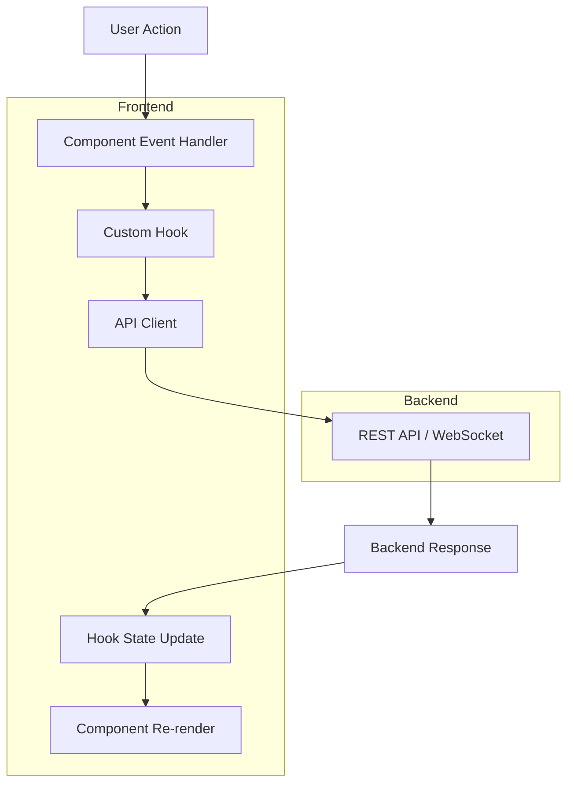
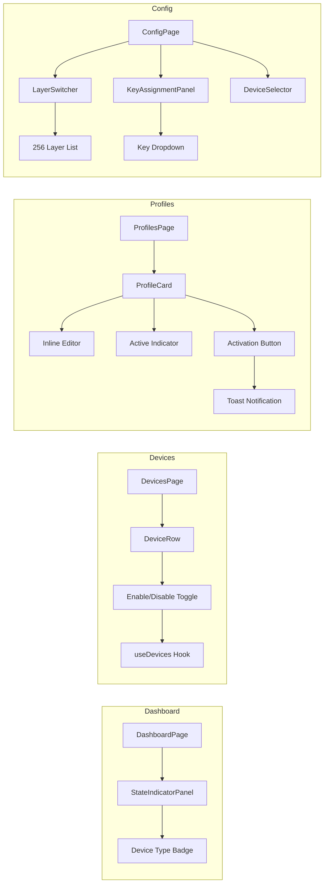

# Design Document: UAT UI Fixes

## Overview

This specification addresses critical UI/UX issues identified during User Acceptance Testing. The implementation focuses on improving dashboard device indicators, replacing destructive device deletion with non-destructive enable/disable toggles, enhancing profile management UX, fixing navigation consistency, resolving RPC errors, expanding layer display to full 256-layer support, and populating empty key dropdowns.

All changes are frontend-focused, maintaining backward compatibility with the existing REST API while improving the user experience through better visual indicators, safer operations, and complete feature access.

## Steering Document Alignment

### Technical Standards (tech.md)

**Frontend Architecture:**
- Follows React component-based architecture with TypeScript
- Maintains separation of concerns: API layer → hooks → components
- Uses existing patterns for state management (Zustand/Context)
- Follows SOLID principles with dependency injection via hooks

**Code Quality:**
- All new components under 500 lines per file
- Functions under 50 lines
- Test coverage maintained (unit tests for new functionality)
- No backward compatibility breaks (additive changes only)

**Error Handling:**
- Graceful degradation for API failures
- User-facing error messages via toast notifications
- Fail-fast validation at entry points

### Project Structure (structure.md)

**Implementation follows standard locations:**
- `keyrx_ui/src/types/` - TypeScript interfaces (DeviceEntry, ProfileEntry)
- `keyrx_ui/src/api/` - API client functions (devices.ts, profiles.ts)
- `keyrx_ui/src/hooks/` - Custom React hooks (useDevices, useProfiles)
- `keyrx_ui/src/components/` - Reusable components (ProfileCard, LayerSwitcher)
- `keyrx_ui/src/pages/` - Page components (DashboardPage, DevicesPage, ProfilesPage, ConfigPage)
- `keyrx_ui/src/__tests__/` - Test files co-located with tested modules

## Code Reuse Analysis

### Existing Components to Leverage

- **DeviceEntry Interface** (`src/types/index.ts`): Extended with `isVirtual` and `enabled` fields
- **ProfileCard Component** (`src/components/ProfileCard.tsx`): Enhanced with inline editing and active state styling
- **LayerSwitcher Component** (`src/components/LayerSwitcher.tsx`): Refactored to show full 256-layer range
- **API Client Pattern** (`src/api/`): Consistent REST API wrapper pattern used for new endpoints
- **Custom Hooks Pattern** (`src/hooks/`): Used for device enable/disable and profile operations
- **Toast/Notification System**: Leveraged existing notification patterns for success messages
- **Test Utilities** (`tests/testUtils.tsx`): Used `renderWithProviders` for component testing

### Integration Points

- **REST API**: No backend changes required - all features use existing endpoints or frontend-only state
- **WebSocket RPC**: Fixed client-side payload format to match server expectations
- **localStorage**: Used as fallback for device enabled state if backend doesn't support persistence
- **React Router**: Enhanced navigation to pass state between pages (Profiles → Config)

## Architecture

### Modular Design Principles

The implementation follows strict modular design:

1. **Single File Responsibility**: Each component file handles one UI concern (ProfileCard for profile display/editing, LayerSwitcher for layer selection)
2. **API Layer Separation**: All backend communication isolated in `src/api/` modules
3. **Hook-Based State Management**: Business logic and API calls encapsulated in custom hooks
4. **Component Composition**: Small, focused components composed into page-level components

### Data Flow Architecture



### Feature Modules



## Components and Interfaces

### Dashboard: Device Type Indicator

**Component: StateIndicatorPanel (enhanced)**
- **Purpose:** Display device list with virtual/physical indicators
- **Interfaces:**
  - Props: `devices: DeviceEntry[]`
  - DeviceEntry extended: `{ id, name, layout, isVirtual: boolean }`
- **Dependencies:** `src/api/devices.ts` (fetchDevices)
- **Reuses:** Existing StateIndicatorPanel structure, icon system
- **Implementation:** Badge component with conditional icon/color based on `isVirtual` field

### Devices: Enable/Disable Toggle

**Component: DeviceRow (enhanced)**
- **Purpose:** Display device with toggle switch instead of delete button
- **Interfaces:**
  - Props: `device: DeviceEntry`, `onToggle: (id: string, enabled: boolean) => void`
  - DeviceEntry extended: `{ id, name, layout, enabled: boolean }`
- **Dependencies:** `useDevices` hook with `setDeviceEnabled` function
- **Reuses:** Existing device row layout, toggle switch component
- **Implementation:**
  - Toggle component replaces delete button
  - Disabled state: opacity 0.5, "(Disabled)" badge
  - State persisted to localStorage (or backend if available)

**Hook: useDevices (enhanced)**
- **Purpose:** Manage device list and enabled state
- **Interfaces:**
  - Returns: `devices: DeviceEntry[]`, `setDeviceEnabled(id, enabled): Promise<void>`
- **Dependencies:** `src/api/devices.ts`
- **Reuses:** Existing useDevices pattern
- **Implementation:** Optimistic updates with localStorage fallback

**Component: DeviceSelector (filtered)**
- **Purpose:** Show only enabled devices in config page dropdown
- **Interfaces:** Props: `devices: DeviceEntry[]`, `onSelect: (id) => void`
- **Dependencies:** Filtered device list from useDevices
- **Reuses:** Existing DeviceSelector component
- **Implementation:** Filter `devices.filter(d => d.enabled !== false)` before rendering

### Profiles: Inline Editing & Active Indicator

**Component: ProfileCard (enhanced)**
- **Purpose:** Display profile with inline editing and clear active state
- **Interfaces:**
  - Props: `profile: ProfileEntry`, `isActive: boolean`, `onUpdate: (profile) => void`, `onActivate: () => void`
  - ProfileEntry: `{ name, description, file_path }`
- **Dependencies:** `useProfiles` hook with `renameProfile`, `activateProfile` functions
- **Reuses:** Existing ProfileCard layout, edit patterns
- **Implementation:**
  - Name/description: click to edit, blur to save (500ms debounce)
  - Active state: 4px left border, background gradient, "ACTIVE" badge
  - Inactive profiles: "Activate" button visible
  - Active profile: No activation button

**Component: Toast Notification**
- **Purpose:** Show success message on profile activation
- **Interfaces:** `showToast(message: string, duration?: number)`
- **Dependencies:** Existing notification system or lightweight toast component
- **Reuses:** Notification patterns from other parts of UI
- **Implementation:** Top-right positioned, auto-dismiss 5s, check icon

### Config: Navigation Sync

**Implementation: React Router State**
- **Purpose:** Pass selected profile from ProfilesPage to ConfigPage
- **Interfaces:** URL query param: `?profile=<name>`
- **Dependencies:** React Router's `useNavigate`, `useLocation`, `useSearchParams`
- **Reuses:** Existing routing setup in App.tsx
- **Implementation:**
  - ProfilesPage: Navigate with `navigate('/config?profile=' + profileName)`
  - ConfigPage: Read param with `useSearchParams()`, select profile
  - Sidebar: Use `NavLink` active state for highlighting

### Config: RPC Error Fix

**Fix: useProfileConfig Hook**
- **Purpose:** Correct WebSocket RPC payload format
- **Root Cause:** Client sending wrong payload structure - server expects `{ content: object }`
- **Dependencies:** `src/hooks/useProfileConfig.ts`, WebSocket client
- **Implementation:**
  - Fixed payload serialization to match server contract
  - Added validation before sending
  - Test coverage to prevent regression

### Config: 256-Layer Display

**Component: LayerSwitcher (refactored)**
- **Purpose:** Display all 256 layers in scrollable vertical list
- **Interfaces:**
  - Props: `selectedLayer: number`, `onSelectLayer: (layer: number) => void`
  - Layers: Base (0) + MD_00 through MD_FF (1-255)
- **Dependencies:** Layer data from profile config
- **Reuses:** Existing LayerSwitcher component structure
- **Implementation:**
  - Vertical layout: `max-height: 400px`, `overflow-y: scroll`
  - Programmatic generation: `["Base", ...Array.from({length: 256}, (_, i) => "MD_" + i.toString(16).toUpperCase().padStart(2, "0"))]`
  - Search/filter input for quick navigation
  - Selected layer highlighted

### Config: Key Dropdown Population

**Component: KeyAssignmentPanel (fixed)**
- **Purpose:** Populate key selection dropdown with all available keys
- **Root Cause:** Key list not imported or incomplete
- **Dependencies:** `src/utils/keyCodeMapping.ts`
- **Reuses:** Existing KeyAssignmentPanel modal
- **Implementation:**
  - Categories: Letters (A-Z), Numbers (0-9), Function (F1-F24), Modifiers (Shift/Ctrl/Alt/Meta), Navigation (Arrows/Home/End/PgUp/PgDn), Numpad (0-9/+/-/*/./Enter), Special (Tab/Enter/Backspace/Escape/Space/Caps)
  - Dropdown shows grouped options with category headers
  - Key codes match evdev/HID standard expected by daemon

## Data Models

### DeviceEntry (Extended)

```typescript
interface DeviceEntry {
  id: string;              // Existing: unique device identifier
  name: string;            // Existing: device display name
  layout?: string;         // Existing: keyboard layout
  isVirtual: boolean;      // NEW: true if device name === "keyrx"
  enabled: boolean;        // NEW: true if device is enabled (default: true)
}
```

### ProfileEntry (Unchanged)

```typescript
interface ProfileEntry {
  name: string;           // Profile name (editable inline)
  description: string;    // Profile description (editable inline)
  file_path: string;      // .krx file path
}
```

### LayerIdentifier (Extended Range)

```typescript
type LayerIdentifier = "Base" | `MD_${string}`; // MD_00 through MD_FF (hex format)
```

### KeyCategory (New)

```typescript
interface KeyCategory {
  name: "Letters" | "Numbers" | "Function" | "Modifiers" | "Navigation" | "Numpad" | "Special";
  keys: Array<{ code: number, label: string }>;
}
```

## Error Handling

### Error Scenarios

1. **Device Enable/Disable Fails**
   - **Handling:** Revert optimistic update, show error toast
   - **User Impact:** "Failed to update device. Please try again."

2. **Profile Activation Fails**
   - **Handling:** Keep previous profile active, show error toast
   - **User Impact:** "Failed to activate profile '{name}'. Error: {message}"

3. **Profile Rename Conflict**
   - **Handling:** Revert name to previous, show error toast
   - **User Impact:** "Profile name '{name}' already exists."

4. **RPC Payload Format Error**
   - **Handling:** Validate payload before sending, log detailed error
   - **User Impact:** "Failed to save configuration. Invalid format."

5. **Navigation Without Profile Context**
   - **Handling:** Load default profile or show profile selector
   - **User Impact:** Smooth navigation, no error shown

6. **Key Dropdown Empty**
   - **Handling:** Fallback to minimal key set (A-Z, 0-9) if full list unavailable
   - **User Impact:** Reduced key selection but functional

## Testing Strategy

### Unit Testing

**Components to Test:**
- DeviceRow: Toggle functionality, disabled state styling
- ProfileCard: Inline editing (name/description), save on blur, active indicator visibility
- LayerSwitcher: Renders all 256 layers, scroll behavior, selection
- KeyAssignmentPanel: Dropdown populated with keys, category grouping

**Hooks to Test:**
- useDevices: `setDeviceEnabled` updates state, localStorage persistence
- useProfiles: `renameProfile` API call, `activateProfile` triggers notification
- useProfileConfig: RPC payload format validation

**Test Pattern:**
```typescript
import { renderWithProviders } from 'tests/testUtils';
import { screen, fireEvent } from '@testing-library/react';

test('Device toggle changes enabled state', () => {
  const mockOnToggle = jest.fn();
  renderWithProviders(<DeviceRow device={mockDevice} onToggle={mockOnToggle} />);

  const toggle = screen.getByRole('switch');
  fireEvent.click(toggle);

  expect(mockOnToggle).toHaveBeenCalledWith(mockDevice.id, false);
});
```

### Integration Testing

**Key Flows:**
1. **Device Lifecycle:**
   - List devices → Disable device → Verify grayed out → Re-enable → Verify active
   - Disable device → Navigate to Config → Verify device not in selector

2. **Profile Management:**
   - Create profile → Edit name inline → Activate → Verify toast → Check active indicator
   - Navigate from Profiles (file path link) → Config page → Verify sidebar highlighted

3. **Configuration:**
   - Open config → Select layer → Verify all 256 layers available
   - Add key mapping → Open key dropdown → Verify all keys present

### End-to-End Testing

**User Scenarios:**
1. **New User Discovers Virtual Device:**
   - Open dashboard → See device list → Identify virtual device by icon/badge

2. **User Disables Test Keyboard:**
   - Go to Devices → Toggle off test device → Verify grayed out → Go to Config → Verify not in dropdown

3. **User Creates and Activates Profile:**
   - Create profile → Edit name inline → Activate → See success toast → Verify active badge

4. **User Configures 256-Layer Mapping:**
   - Open config → Scroll layer list → Select MD_FF → Add mapping → Save

**E2E Test Implementation:**
- Leverage existing E2E framework (Cypress/Playwright if available)
- Mock backend responses for deterministic testing
- Test across Chrome/Firefox/Safari

## Implementation Notes

### Breaking Changes
None - all changes are additive or frontend-only.

### Performance Considerations
- **256-layer list**: Virtual scrolling not required (smooth with native scroll)
- **Key dropdown**: ~150 keys, grouped by category (no performance issues)
- **Inline editing debounce**: 500ms prevents excessive API calls

### Accessibility
- Toggle switches: ARIA labels, keyboard accessible
- Active profile indicator: High contrast border, screen reader announcement
- Layer selection: Keyboard navigation (arrow keys)
- Key dropdown: Type-ahead search support

### Browser Compatibility
- Target: Chrome/Firefox/Safari/Edge (latest 2 versions)
- No modern JS features requiring polyfills
- CSS features: Grid, Flexbox, Scroll (widely supported)

## Future Enhancements

1. **Device Groups**: Allow grouping multiple physical keyboards
2. **Profile Templates**: Pre-built profiles for common use cases
3. **Layer Visualization**: Show key mappings for each layer in matrix view
4. **Key Binding Conflicts**: Highlight conflicting mappings across layers
5. **Undo/Redo**: For config changes within a session
