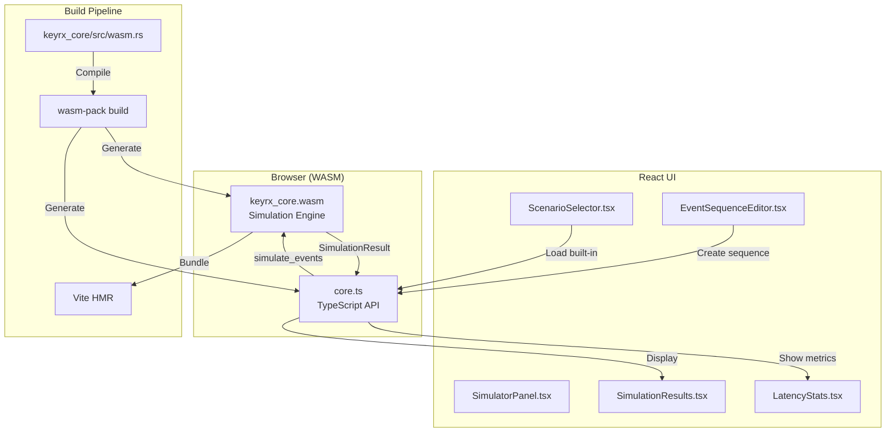

# Design Document

## Overview

The WASM Simulation Integration feature enables browser-based testing of KeyRx configurations by compiling keyrx_core to WebAssembly. This creates an instant feedback loop: users edit configurations in the web UI, simulate event sequences with microsecond precision, and see exactly how the DFA state machine will process their mappings—all without reloading the daemon.

The design leverages keyrx's existing no_std architecture: keyrx_core is already platform-agnostic and heap-allocation-free, making WASM compilation straightforward. We add a thin WASM binding layer (wasm.rs), a TypeScript API wrapper, and React UI components for event creation and result visualization.

**Key Innovation**: 100% code reuse between daemon and browser simulation. The same Rust code that processes real keyboard events in the daemon also runs in the browser via WASM, eliminating behavior drift between testing and production.

## Steering Document Alignment

### Technical Standards (tech.md)

**Four-Crate Architecture**:
- **keyrx_core**: Already no_std, already supports WASM compilation target (`wasm32-unknown-unknown`)
- **keyrx_ui**: React + TypeScript frontend already exists, we add simulator components
- **keyrx_compiler**: Rhai parser reused for browser-side config compilation

**Technology Stack Alignment**:
- **wasm-pack** (tech.md line 24): Build tool for Rust → WASM
- **wasm-bindgen** (tech.md line 71): Rust ↔ JavaScript FFI (already specified)
- **serde-wasm-bindgen** (tech.md line 72): Serde across WASM boundary (already specified)
- **React 18+** (tech.md line 69): UI framework (existing)

**Performance Requirements** (tech.md lines 481-492):
- Simulation SHALL meet same <1ms latency requirement as daemon
- WASM module SHALL achieve <50ns MPHF lookup (same as native Rust)
- Event processing SHALL complete in <100μs (same as daemon pipeline)

**Security** (tech.md lines 513-522):
- WASM runs in browser sandbox (no filesystem, no network)
- Rhai engine sandboxed (cannot execute arbitrary code)
- Rust memory safety (`forbid(unsafe_code)` in keyrx_core)

### Project Structure (structure.md)

**Crate Organization** (structure.md lines 24-43):
```
keyrx_core/
├── src/
│   ├── lib.rs              # Add #[cfg(target_arch = "wasm32")] pub mod wasm;
│   ├── simulator.rs        # Existing (reused 100%)
│   └── wasm.rs             # NEW: WASM bindings
└── Cargo.toml              # Add [lib] crate-type = ["cdylib"]
```

**UI Organization** (structure.md lines 89-107):
```
keyrx_ui/
├── src/
│   ├── components/
│   │   ├── Simulator/                    # NEW
│   │   │   ├── SimulatorPanel.tsx        # Main container
│   │   │   ├── EventSequenceEditor.tsx   # Event creation
│   │   │   ├── ScenarioSelector.tsx      # Built-in scenarios
│   │   │   ├── SimulationResults.tsx     # Timeline visualization
│   │   │   └── LatencyStats.tsx          # Performance metrics
│   │   └── DeviceList.tsx                # Existing
│   ├── wasm/
│   │   └── core.ts                       # NEW: TypeScript API wrapper
│   └── hooks/
│       └── useSimulator.ts               # NEW: WASM simulation hook
└── package.json                          # Add wasm-pack build script
```

**Naming Conventions** (structure.md lines 109-135):
- Rust modules: `snake_case.rs` → `wasm.rs`
- React components: `PascalCase.tsx` → `SimulatorPanel.tsx`
- Hooks: `use[Feature].ts` → `useSimulator.ts`

**Import Patterns** (structure.md lines 137-175):
- Rust: Standard lib → External deps → Workspace crates → Current crate
- TypeScript: React → External → Internal (absolute) → Relative → Styles

## Code Reuse Analysis

### Existing Components to Leverage

**100% Reuse from keyrx_core** (no modifications needed):
- **simulator.rs**: Existing simulation engine with event processing, state tracking, latency measurement
- **dfa.rs**: DFA state machine (Tap/Hold logic)
- **state.rs**: 255-bit modifier/lock state management (fixedbitset)
- **lookup.rs**: MPHF-based O(1) key lookup
- **config.rs**: rkyv-serialized configuration structures

**Partial Reuse from keyrx_compiler**:
- **parser.rs**: Rhai AST evaluation (adapt for WASM, no file I/O)
- **dfa_gen.rs**: DFA compilation from Tap/Hold configs
- **mphf_gen.rs**: MPHF generation (boomphf)

**Existing keyrx_ui Components**:
- **App.tsx**: Root component (add SimulatorPanel route)
- **DeviceList.tsx**: Existing component (reference for styling consistency)

### Integration Points

**1. WASM Module ↔ JavaScript**:
- **Interface**: keyrx_core/src/wasm.rs exports 4 functions via wasm-bindgen
- **Data Flow**: JavaScript calls WASM → WASM processes → returns JSON
- **Error Handling**: Rust `Result` → JavaScript `Promise` (catch panics)

**2. React UI ↔ WASM Module**:
- **Interface**: keyrx_ui/src/wasm/core.ts TypeScript wrapper
- **Data Flow**: UI creates event sequence → calls WASM → displays results
- **State Management**: React useState for UI, WASM linear memory for simulation state

**3. Configuration Editor ↔ Simulator**:
- **Interface**: "Test Configuration" button in ConfigEditor
- **Data Flow**: Current config text → WASM load_config → simulation ready
- **Error Feedback**: Parse errors displayed inline in editor

**4. Vite Build ↔ WASM Build**:
- **Interface**: Vite plugin watches keyrx_core changes, triggers wasm-pack
- **Data Flow**: Rust code change → wasm-pack build → Vite HMR reload
- **Output**: WASM binary + TypeScript types in keyrx_ui/src/wasm/

## Architecture

### High-Level Design



### Modular Design Principles

**Single File Responsibility**:
- `wasm.rs`: WASM FFI bindings only (no business logic)
- `core.ts`: TypeScript wrapper only (no UI logic)
- `SimulatorPanel.tsx`: Layout and routing only (delegates to child components)
- `EventSequenceEditor.tsx`: Event creation UI only (no simulation logic)
- `SimulationResults.tsx`: Visualization only (no event processing)

**Component Isolation**:
- Each React component is self-contained (own state, props interface)
- WASM module is stateless between calls (no global mutable state)
- TypeScript wrapper handles error conversion (isolates WASM panics)

**Service Layer Separation**:
- **Data Access**: WASM module reads config from memory
- **Business Logic**: Simulation engine (existing keyrx_core code)
- **Presentation**: React components render results

**Utility Modularity**:
- Event builders (press/release helpers) in separate utility file
- Timestamp generators (microsecond precision) in separate utility
- Built-in scenarios (tap-hold, layers) in separate file

### Data Flow

```
┌─────────────────────────────────────────────────────────┐
│ User Action: "Test Tap-Hold Configuration"             │
└────────────────────┬────────────────────────────────────┘
                     │
                     ▼
┌─────────────────────────────────────────────────────────┐
│ 1. ConfigEditor.tsx                                     │
│    - Get current Rhai config text from editor          │
│    - Call: loadConfig(rhaiSource)                      │
└────────────────────┬────────────────────────────────────┘
                     │
                     ▼
┌─────────────────────────────────────────────────────────┐
│ 2. core.ts (TypeScript Wrapper)                        │
│    - Validate input (non-empty string)                 │
│    - Call WASM: wasm.load_config(rhaiSource)           │
│    - Convert Result → Promise                          │
└────────────────────┬────────────────────────────────────┘
                     │
                     ▼
┌─────────────────────────────────────────────────────────┐
│ 3. wasm.rs (WASM Bindings)                             │
│    - Parse Rhai source (reuse compiler parser)         │
│    - Generate DFA (reuse compiler dfa_gen)             │
│    - Generate MPHF (reuse compiler mphf_gen)           │
│    - Return ConfigHandle (opaque ID)                   │
└────────────────────┬────────────────────────────────────┘
                     │
                     ▼
┌─────────────────────────────────────────────────────────┐
│ 4. User Action: "Run Simulation"                       │
│    - Select scenario: "Tap-Hold Under Threshold"       │
│    - ScenarioSelector.tsx → EventSequence              │
│    - Call: simulate(configHandle, eventSequence)       │
└────────────────────┬────────────────────────────────────┘
                     │
                     ▼
┌─────────────────────────────────────────────────────────┐
│ 5. wasm.rs (Event Processing)                          │
│    - Lookup ConfigHandle → DFA + MPHF                  │
│    - For each event in sequence:                       │
│       * Process via simulator.rs (existing code)       │
│       * Track DFA state transitions                    │
│       * Measure latency (micros)                       │
│    - Return SimulationResult (JSON)                    │
└────────────────────┬────────────────────────────────────┘
                     │
                     ▼
┌─────────────────────────────────────────────────────────┐
│ 6. SimulationResults.tsx                               │
│    - Display timeline of events                        │
│    - Highlight state changes (modifiers, layers)       │
│    - Show output events vs input events                │
│    - Render DFA state transitions                      │
└─────────────────────────────────────────────────────────┘
                     │
                     ▼
┌─────────────────────────────────────────────────────────┐
│ 7. LatencyStats.tsx                                     │
│    - Display min/avg/max/p95/p99 latency               │
│    - Warn if any event >5ms                            │
│    - Show performance comparison vs requirements       │
└─────────────────────────────────────────────────────────┘
```

## Components and Interfaces

### Component 1: WASM Module (keyrx_core/src/wasm.rs)

**Purpose**: Expose keyrx_core simulation functionality to JavaScript via WebAssembly.

**Interfaces**:
```rust
#[wasm_bindgen]
pub fn load_config(rhai_source: &str) -> Result<ConfigHandle, JsValue>;

#[wasm_bindgen]
pub fn load_krx(binary: &[u8]) -> Result<ConfigHandle, JsValue>;

#[wasm_bindgen]
pub fn simulate(config: ConfigHandle, events_json: &str) -> Result<JsValue, JsValue>;

#[wasm_bindgen]
pub fn get_state(config: ConfigHandle) -> Result<JsValue, JsValue>;

// Internal types (not exposed to JS)
struct ConfigHandle(usize); // Index into global CONFIG_STORE
```

**Dependencies**:
- wasm-bindgen (FFI)
- serde-wasm-bindgen (JSON serialization)
- keyrx_core::simulator (event processing)
- keyrx_compiler::parser (Rhai parsing, feature-gated)

**Reuses**:
- 100% of keyrx_core::simulator logic
- keyrx_compiler parser (adapted for no file I/O)

**Error Handling**:
- Rhai parse errors → `JsValue::from_str("Parse error: line 42")`
- Invalid ConfigHandle → `JsValue::from_str("Invalid config handle")`
- Panics caught by wasm-bindgen panic hook → JavaScript exception

### Component 2: TypeScript API Wrapper (keyrx_ui/src/wasm/core.ts)

**Purpose**: Provide type-safe, Promise-based API for calling WASM functions from JavaScript.

**Interfaces**:
```typescript
export class WasmCore {
  static async init(): Promise<void>;

  async loadConfig(rhaiSource: string): Promise<ConfigHandle>;
  async loadKrx(binary: Uint8Array): Promise<ConfigHandle>;
  async simulate(config: ConfigHandle, events: EventSequence): Promise<SimulationResult>;
  async getState(config: ConfigHandle): Promise<DaemonState>;
}

export type ConfigHandle = number;

export interface EventSequence {
  events: KeyEvent[];
  seed?: number;
}

export interface SimulationResult {
  outputs: KeyEvent[];
  stateChanges: StateChange[];
  latencyStats: LatencyStats;
  warnings: string[];
}
```

**Dependencies**:
- keyrx_core_wasm (generated by wasm-pack)
- serde JSON types (auto-generated TypeScript interfaces)

**Reuses**:
- WASM module (generated by wasm-pack)

**Error Handling**:
- Convert WASM panics to TypeScript errors
- Validate inputs before calling WASM
- Provide meaningful error messages (not raw WASM errors)

### Component 3: SimulatorPanel.tsx

**Purpose**: Main container for simulation UI, handles layout and routing between sub-components.

**Interfaces**:
```typescript
export function SimulatorPanel() {
  const [config, setConfig] = useState<ConfigHandle | null>(null);
  const [simulationResult, setSimulationResult] = useState<SimulationResult | null>(null);

  const handleLoadConfig = async (rhaiSource: string) => { ... };
  const handleSimulate = async (eventSequence: EventSequence) => { ... };

  return (
    <div>
      <ConfigLoader onLoad={handleLoadConfig} />
      <ScenarioSelector onSelect={handleSimulate} />
      <EventSequenceEditor onSubmit={handleSimulate} />
      {simulationResult && (
        <>
          <SimulationResults result={simulationResult} />
          <LatencyStats stats={simulationResult.latencyStats} />
        </>
      )}
    </div>
  );
}
```

**Dependencies**:
- React (useState, useEffect)
- WasmCore (from wasm/core.ts)
- Child components (ScenarioSelector, EventSequenceEditor, etc.)

**Reuses**:
- Existing UI styling patterns from DeviceList.tsx

### Component 4: EventSequenceEditor.tsx

**Purpose**: UI for creating custom event sequences with precise timestamps.

**Interfaces**:
```typescript
interface EventSequenceEditorProps {
  onSubmit: (sequence: EventSequence) => void;
}

export function EventSequenceEditor({ onSubmit }: EventSequenceEditorProps) {
  const [events, setEvents] = useState<KeyEvent[]>([]);

  const addEvent = (type: 'press' | 'release', keyCode: string, timestampUs: number) => { ... };
  const removeEvent = (index: number) => { ... };
  const handleSubmit = () => onSubmit({ events });

  return (
    <div>
      <EventList events={events} onRemove={removeEvent} />
      <EventCreator onAdd={addEvent} />
      <button onClick={handleSubmit}>Simulate</button>
    </div>
  );
}
```

**Dependencies**:
- React (useState)
- Event types from wasm/core.ts

**Reuses**:
- None (new component)

### Component 5: ScenarioSelector.tsx

**Purpose**: Dropdown menu for built-in test scenarios (tap-hold, layer switching, etc.).

**Interfaces**:
```typescript
interface ScenarioSelectorProps {
  onSelect: (sequence: EventSequence) => void;
}

const BUILT_IN_SCENARIOS = {
  'tap-hold-under-threshold': generateTapHoldUnder,
  'tap-hold-over-threshold': generateTapHoldOver,
  'layer-switch': generateLayerSwitch,
  'modifier-combo': generateModifierCombo,
};

export function ScenarioSelector({ onSelect }: ScenarioSelectorProps) {
  const handleSelect = (scenarioId: string) => {
    const sequence = BUILT_IN_SCENARIOS[scenarioId]();
    onSelect(sequence);
  };

  return <select onChange={e => handleSelect(e.target.value)}>...</select>;
}
```

**Dependencies**:
- React
- Scenario generators (separate utility file)

**Reuses**:
- None (new component)

### Component 6: SimulationResults.tsx

**Purpose**: Timeline visualization of event processing, showing input events, state changes, and output events.

**Interfaces**:
```typescript
interface SimulationResultsProps {
  result: SimulationResult;
}

export function SimulationResults({ result }: SimulationResultsProps) {
  return (
    <div className="timeline">
      {result.stateChanges.map(change => (
        <StateChangeEvent key={change.timestampUs} change={change} />
      ))}
      <OutputComparison inputs={...} outputs={result.outputs} />
    </div>
  );
}
```

**Dependencies**:
- React
- SimulationResult type from wasm/core.ts

**Reuses**:
- None (new component)

### Component 7: LatencyStats.tsx

**Purpose**: Display latency statistics (min/avg/max/p95/p99) with performance warnings.

**Interfaces**:
```typescript
interface LatencyStatsProps {
  stats: LatencyStats;
}

export function LatencyStats({ stats }: LatencyStatsProps) {
  const hasWarning = stats.max > 5000; // 5ms

  return (
    <table>
      <tr><td>Min:</td><td>{stats.min}μs</td></tr>
      <tr><td>Avg:</td><td>{stats.avg}μs</td></tr>
      <tr><td>Max:</td><td className={hasWarning ? 'warning' : ''}>{stats.max}μs</td></tr>
      <tr><td>P95:</td><td>{stats.p95}μs</td></tr>
      <tr><td>P99:</td><td>{stats.p99}μs</td></tr>
    </table>
  );
}
```

**Dependencies**:
- React
- LatencyStats type from wasm/core.ts

**Reuses**:
- None (new component)

## Data Models

### ConfigHandle (Opaque Reference)

**Purpose**: Opaque identifier for loaded configurations (prevents direct memory access from JavaScript).

```rust
// Rust (wasm.rs)
#[wasm_bindgen]
pub struct ConfigHandle(usize);

// TypeScript (core.ts)
export type ConfigHandle = number;
```

**Lifecycle**:
1. Created by `load_config` or `load_krx`
2. Passed to `simulate` or `get_state`
3. Automatically dropped when WASM module reloads (no explicit cleanup needed)

### EventSequence

**Purpose**: Sequence of keyboard events with precise timestamps for simulation.

```typescript
// TypeScript (core.ts)
export interface EventSequence {
  events: KeyEvent[];
  seed?: number; // Optional: for reproducible random sequences
}

export interface KeyEvent {
  type: 'press' | 'release';
  keyCode: string; // e.g., "KEY_A", "KEY_LEFTSHIFT"
  timestampUs: number; // Microseconds since sequence start
  deviceId?: string; // Optional: for multi-device simulation
}
```

**Rust Equivalent** (internal to WASM):
```rust
// Deserialized from JSON via serde-wasm-bindgen
#[derive(Deserialize)]
pub struct EventSequence {
    pub events: Vec<KeyEvent>,
    pub seed: Option<u64>,
}

#[derive(Deserialize)]
pub struct KeyEvent {
    pub event_type: EventType,
    pub key_code: String,
    pub timestamp_us: u64,
    pub device_id: Option<String>,
}
```

### SimulationResult

**Purpose**: Output of simulation, includes processed events, state changes, and performance metrics.

```typescript
// TypeScript (core.ts)
export interface SimulationResult {
  outputs: KeyEvent[];
  stateChanges: StateChange[];
  latencyStats: LatencyStats;
  warnings: string[];
}

export interface StateChange {
  timestampUs: number;
  type: 'modifier' | 'lock' | 'layer';
  action: 'activate' | 'deactivate';
  id: string; // e.g., "MD_00", "LK_00", "layer_vim"
}

export interface LatencyStats {
  min: number;   // Microseconds
  avg: number;
  max: number;
  p95: number;
  p99: number;
}
```

**Rust Equivalent** (internal to WASM):
```rust
// Serialized to JSON via serde-wasm-bindgen
#[derive(Serialize)]
pub struct SimulationResult {
    pub outputs: Vec<KeyEvent>,
    pub state_changes: Vec<StateChange>,
    pub latency_stats: LatencyStats,
    pub warnings: Vec<String>,
}
```

### DaemonState (for get_state API)

**Purpose**: Current state of modifiers, locks, and active layer (matches daemon IPC response).

```typescript
// TypeScript (core.ts)
export interface DaemonState {
  activeModifiers: string[];  // e.g., ["MD_00", "MD_01"]
  activeLocks: string[];      // e.g., ["LK_00"]
  activeLayer: string;        // e.g., "base", "vim_mode"
  rawState: number[];         // 255-bit state vector
}
```

**Rust Equivalent**:
```rust
#[derive(Serialize)]
pub struct DaemonState {
    pub active_modifiers: Vec<String>,
    pub active_locks: Vec<String>,
    pub active_layer: String,
    pub raw_state: Vec<u8>, // fixedbitset serialized
}
```

## Error Handling

### Error Scenarios

**1. Configuration Parse Error**
- **Trigger**: Invalid Rhai syntax in `load_config`
- **Handling**: Return `Err(JsValue)` with line number and error message
- **User Impact**: Red error message below config editor: "Parse error on line 42: Expected ';'"

**2. Invalid ConfigHandle**
- **Trigger**: User calls `simulate` with handle from previous page load
- **Handling**: Return `Err(JsValue)` with "Invalid config handle, please reload"
- **User Impact**: Toast notification: "Configuration expired, please reload"

**3. WASM Module Load Failure**
- **Trigger**: Browser doesn't support WASM, or module file corrupted
- **Handling**: WasmCore.init() throws error
- **User Impact**: Red banner: "Simulation unavailable (WASM not supported)"

**4. Event Sequence Validation Error**
- **Trigger**: User creates event with timestamp < 0 or invalid key code
- **Handling**: TypeScript validation before calling WASM
- **User Impact**: Inline error: "Timestamp must be positive"

**5. WASM Panic (Internal Error)**
- **Trigger**: Unexpected error in Rust code (should be rare)
- **Handling**: wasm-bindgen panic hook catches, converts to JavaScript exception
- **User Impact**: Modal dialog: "Unexpected error, please report this bug"

**6. Simulation Performance Warning**
- **Trigger**: Any event processing >5ms latency
- **Handling**: Include warning string in SimulationResult.warnings
- **User Impact**: Yellow warning icon: "Event #42 took 6.2ms (expected <5ms)"

### Error Recovery

- **Transient errors** (parse errors, validation): User fixes input, retries
- **Persistent errors** (WASM load failure): Fallback to daemon-only mode (simulation disabled)
- **Internal errors** (panics): Logged to console, user can report bug

## Testing Strategy

### Unit Testing

**Rust (wasm.rs)**:
- Test each WASM function with valid/invalid inputs
- Test error conversion (Rust Result → JsValue)
- Test ConfigHandle lifecycle (create → use → drop)
- Mock JavaScript calls using wasm-bindgen-test

**TypeScript (core.ts)**:
- Test WasmCore.init() success and failure paths
- Test event sequence validation
- Test error message conversion
- Mock WASM module responses

**React Components**:
- Test SimulatorPanel state management (config loaded → simulate → results displayed)
- Test EventSequenceEditor event creation and removal
- Test ScenarioSelector scenario generation
- Test SimulationResults timeline rendering
- Test LatencyStats warning detection

### Integration Testing

**WASM ↔ JavaScript**:
- Test full flow: load_config → simulate → results parsed correctly
- Test event sequence with 1000 events (performance)
- Test all built-in scenarios produce expected outputs
- Test error propagation (Rust error → JavaScript exception)

**React UI ↔ WASM**:
- Test "Test Configuration" button flow (ConfigEditor → WASM)
- Test custom event sequence creation → simulation → display
- Test built-in scenario selection → simulation → display
- Test error display (parse error shown in UI)

### End-to-End Testing

**User Scenarios**:

**Scenario 1: Tap-Hold Configuration Testing**
1. User writes tap-hold config in editor: `KEY_A → tap:A, hold:Ctrl`
2. User clicks "Test Configuration" → config loaded into WASM
3. User selects "Tap-Hold Under Threshold" scenario
4. Simulation runs, displays:
   - Input: Press KEY_A (0μs), Release KEY_A (150μs)
   - Output: Press A (150μs), Release A (151μs)
   - State: No modifier activated
5. User selects "Tap-Hold Over Threshold" scenario
6. Simulation runs, displays:
   - Input: Press KEY_A (0μs), Release KEY_A (250μs)
   - Output: Press Ctrl (200μs), Release Ctrl (250μs)
   - State: Modifier activated at 200μs

**Expected Result**: User confirms tap-hold threshold (200ms) is correct.

**Scenario 2: Performance Testing with 1000 Events**
1. User creates custom sequence with 1000 key presses
2. User clicks "Simulate"
3. Simulation completes in <100ms
4. LatencyStats shows all events <5ms
5. No performance warnings

**Expected Result**: Simulation meets <100ms requirement.

**Scenario 3: Configuration Error Handling**
1. User writes invalid Rhai config: `KEY_A →`
2. User clicks "Test Configuration"
3. Error message displays: "Parse error on line 1: Expected mapping target"
4. User fixes: `KEY_A → KEY_B`
5. User retries, simulation succeeds

**Expected Result**: Clear error feedback helps user fix config.

### Build Integration Testing

**WASM Build Pipeline**:
- Test `wasm-pack build` succeeds on clean checkout
- Test WASM module size <10MB (optimized release build)
- Test TypeScript types generated correctly
- Test Vite bundler includes WASM module

**Continuous Integration (GitHub Actions)**:
- Run all tests on push (Rust tests + TypeScript tests)
- Build WASM module and check size
- Run E2E tests in headless browser (Playwright)

## Build Pipeline

### Development Workflow

**1. WASM Module Development**:
```bash
cd keyrx_core
wasm-pack build --target web --out-dir ../keyrx_ui/src/wasm/pkg
```

**2. UI Development with HMR**:
```bash
cd keyrx_ui
npm run dev  # Vite watches for WASM changes, auto-reloads
```

**3. Full Build (Production)**:
```bash
make build  # Builds WASM + UI + embeds in daemon
```

### Vite Integration

**vite.config.ts**:
```typescript
import { defineConfig } from 'vite';
import react from '@vitejs/plugin-react';
import wasm from 'vite-plugin-wasm';

export default defineConfig({
  plugins: [
    react(),
    wasm(),
    {
      name: 'watch-wasm',
      handleHotUpdate({ file, server }) {
        if (file.includes('keyrx_core/src')) {
          // Trigger wasm-pack rebuild
          exec('cd ../keyrx_core && wasm-pack build --target web');
          server.ws.send({ type: 'full-reload' });
        }
      },
    },
  ],
});
```

### CI/CD Integration

**GitHub Actions** (.github/workflows/wasm.yml):
```yaml
name: WASM Build

on: [push, pull_request]

jobs:
  wasm-build:
    runs-on: ubuntu-latest
    steps:
      - uses: actions/checkout@v3
      - uses: actions-rs/toolchain@v1
        with:
          target: wasm32-unknown-unknown
      - run: cargo install wasm-pack
      - run: cd keyrx_core && wasm-pack build
      - run: ls -lh keyrx_ui/src/wasm/pkg/*.wasm
      - run: test $(stat -c%s keyrx_ui/src/wasm/pkg/*.wasm) -lt 10485760  # <10MB
```

## Performance Optimization

### WASM Module Size Reduction

**Strategies**:
1. **LTO (Link-Time Optimization)**: Enabled in Cargo.toml release profile
2. **wasm-opt**: Post-process with Binaryen optimizer (-Oz flag)
3. **Feature flags**: Exclude daemon-specific code from WASM build
4. **Code splitting**: Load WASM module only when simulator is opened

**Expected Size**:
- Unoptimized: ~15MB
- With LTO: ~8MB
- With wasm-opt: ~6MB
- Gzipped: ~2MB

### Simulation Performance

**Optimizations**:
1. **Reuse existing fast code**: MPHF lookup (4.7ns), DFA transitions (<50ns)
2. **Avoid allocations**: Use arrayvec for fixed-size collections
3. **Batch processing**: Process event sequences without JavaScript callbacks
4. **Lazy state tracking**: Only track state changes if user enables visualization

**Benchmarks** (to be verified):
- 100 events: <10ms
- 1000 events: <100ms
- 10,000 events: <1s

## Security Considerations

**WASM Sandbox**:
- No filesystem access (cannot read/write config files outside browser)
- No network access (cannot exfiltrate data)
- Memory-safe (Rust ownership prevents buffer overflows)

**Input Validation**:
- All user-provided Rhai configs validated before execution
- Event sequences validated (positive timestamps, valid key codes)
- ConfigHandle bounds-checked (prevents out-of-bounds memory access)

**No Secrets in WASM**:
- Configuration data is public (not sensitive)
- No authentication tokens or API keys

## Future Enhancements

**Post-MVP Features** (not in initial implementation):
1. **Record/Replay**: Capture real daemon events, replay in WASM
2. **Visual Config Editor**: Drag-and-drop key mapping (generates Rhai)
3. **Shared Scenarios**: Export/import custom event sequences
4. **Performance Profiling**: Flame graphs for DFA state transitions
5. **Multi-Device Simulation**: Test cross-device modifier interactions
