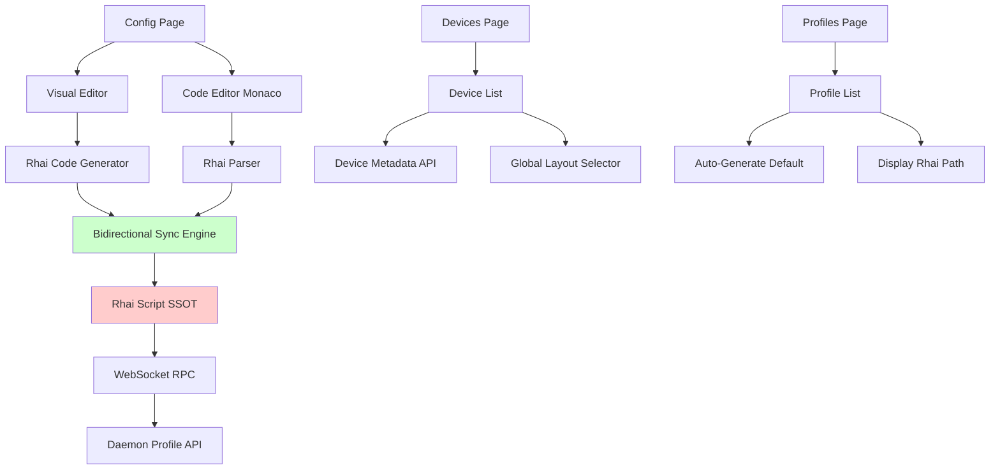

# Design Document

## Overview

The web UI refinement transforms the current implementation to align with the Rhai-driven architecture where the Rhai script is the single source of truth (SSOT) for all configuration. The design introduces:

1. **Rhai Parser** - Parses Rhai scripts to extract device blocks, key mappings, and scope information
2. **Rhai Code Generator** - Generates clean, formatted Rhai code from visual editor changes
3. **Bidirectional Sync Engine** - Keeps visual editor and code editor in sync in real-time
4. **Device-Aware UI** - Removes scope toggles, adds multi-device selection, and displays Rhai-defined scope

This design follows the principle: **"The Rhai script decides scope, not the UI"**.

## Steering Document Alignment

### Technical Standards (tech.md)

- **Rust + TypeScript Stack**: Rhai parsing leverages existing Monaco editor with custom language definition
- **SSOT Principle**: Rhai script is the authoritative source; UI reflects script state, not vice versa
- **Structured Logging**: All parsing errors logged as structured JSON for AI agent consumption
- **AI Coding Agent First**: Parser outputs machine-readable AST for future AI-driven code generation

### Project Structure (structure.md)

- **Frontend Organization**: New utilities in `keyrx_ui/src/utils/` (rhaiParser.ts, rhaiCodeGen.ts)
- **Component Isolation**: DeviceSelector, RhaiSyncEngine as separate, testable components
- **Naming Conventions**: camelCase for functions, PascalCase for components, UPPER_SNAKE_CASE for constants
- **Import Patterns**: Absolute imports from `@/` for internal modules

## Code Reuse Analysis

### Existing Components to Leverage

- **MonacoEditor** (`keyrx_ui/src/components/MonacoEditor.tsx`): Already integrated for Rhai syntax highlighting
- **DeviceSelector** (exists but needs modification): Remove scope toggle, add multi-device checkboxes
- **KeyboardVisualizer** (`keyrx_ui/src/components/KeyboardVisualizer.tsx`): Reuse for multi-device layout display
- **useAutoSave** (`keyrx_ui/src/hooks/useAutoSave.ts`): Leverage for debounced Rhai script saving
- **useProfileConfig** (`keyrx_ui/src/hooks/useProfileConfig.ts`): Extend to include Rhai parsing

### Integration Points

- **WebSocket RPC** (`keyrx_ui/src/hooks/useUnifiedApi.ts`): Use for profile config fetching and saving
- **Device Management API** (`GET /api/devices`, `PATCH /api/devices/:id`): Update to exclude scope field
- **Profile API** (`GET /api/profiles/:name/config`): Returns Rhai script content
- **Monaco Editor**: Integrate custom Rhai language definition for better syntax support

## Architecture

### High-Level Architecture



### Modular Design Principles

- **Single File Responsibility**:
  - `rhaiParser.ts` - Parsing only (no UI logic)
  - `rhaiCodeGen.ts` - Code generation only
  - `RhaiSyncEngine.tsx` - Sync coordination only
  - `DeviceSelector.tsx` - Device selection UI only

- **Component Isolation**:
  - DeviceSelector receives devices as props, emits selection events
  - RhaiParser is a pure function (input: string, output: AST or error)
  - RhaiCodeGen is a pure function (input: mappings, output: string)

- **Service Layer Separation**:
  - API calls isolated in hooks (`useDevices`, `useProfileConfig`)
  - Business logic in utilities (`rhaiParser`, `rhaiCodeGen`)
  - Presentation logic in components

- **Utility Modularity**:
  - `utils/rhaiParser.ts` - Parsing logic
  - `utils/rhaiCodeGen.ts` - Code generation
  - `utils/rhaiFormatter.ts` - Formatting and indentation

## Type Safety and Interface Validation

### Type Generation Strategy

To ensure TypeScript types stay in sync with Rust structs, we will use **typeshare** to automatically generate TypeScript definitions from Rust code.

#### Typeshare Integration

**Rust Side:**
```rust
// keyrx_daemon/src/web/handlers/devices.rs
use typeshare::typeshare;

#[typeshare]
#[derive(Serialize, Deserialize, Debug, Clone)]
pub struct DeviceEntry {
    pub id: String,
    pub name: String,
    pub serial: Option<String>,
    pub layout: LayoutPreset,
    pub last_seen: String,
    pub active: bool,
}

#[typeshare]
#[derive(Serialize, Deserialize, Debug, Clone)]
pub enum LayoutPreset {
    Ansi104,
    Iso105,
    Jis109,
    Hhkb,
    Numpad,
}
```

**Generated TypeScript:**
```typescript
// keyrx_ui/src/types/generated.ts (auto-generated)
export interface DeviceEntry {
    id: string;
    name: string;
    serial: string | null;
    layout: LayoutPreset;
    last_seen: string;
    active: boolean;
}

export type LayoutPreset =
    | "Ansi104"
    | "Iso105"
    | "Jis109"
    | "Hhkb"
    | "Numpad";
```

#### Build Integration

**Rust Build Script:**
```toml
# keyrx_daemon/Cargo.toml
[build-dependencies]
typeshare = "1.0"

[package.metadata.typeshare]
output_directory = "../keyrx_ui/src/types/"
```

**Build Command:**
```bash
# Generate TypeScript types from Rust
cd keyrx_daemon
cargo typeshare --lang typescript --output-file ../keyrx_ui/src/types/generated.ts
```

**CI/CD Integration:**
```yaml
# .github/workflows/ci.yml
- name: Generate TypeScript types
  run: |
    cd keyrx_daemon
    cargo typeshare --lang typescript --output-file ../keyrx_ui/src/types/generated.ts

- name: Check for type changes
  run: |
    git diff --exit-code keyrx_ui/src/types/generated.ts || \
    (echo "TypeScript types out of sync! Run 'cargo typeshare' and commit." && exit 1)
```

### Runtime Validation Strategy

#### Zod Schema Validation

Use **Zod** for runtime validation of API responses in TypeScript:

```typescript
// keyrx_ui/src/api/schemas.ts
import { z } from 'zod';

export const DeviceEntrySchema = z.object({
    id: z.string(),
    name: z.string(),
    serial: z.string().nullable(),
    layout: z.enum(['Ansi104', 'Iso105', 'Jis109', 'Hhkb', 'Numpad']),
    last_seen: z.string(),
    active: z.boolean(),
});

export const DeviceListResponseSchema = z.object({
    devices: z.array(DeviceEntrySchema),
});

// Validation helper
export function validateApiResponse<T>(
    schema: z.ZodSchema<T>,
    data: unknown,
    endpoint: string
): T {
    const result = schema.safeParse(data);

    if (!result.success) {
        console.error(`API validation failed for ${endpoint}:`, result.error);
        throw new Error(`Invalid API response from ${endpoint}: ${result.error.message}`);
    }

    return result.data;
}
```

**Usage in API Calls:**
```typescript
// keyrx_ui/src/hooks/useDevices.ts
import { validateApiResponse, DeviceListResponseSchema } from '@/api/schemas';

async function fetchDevices() {
    const response = await fetch('/api/devices');
    const data = await response.json();

    // Validate response structure
    return validateApiResponse(DeviceListResponseSchema, data, 'GET /api/devices');
}
```

#### Rust Request Validation

Use **validator** crate for Rust-side validation:

```rust
// keyrx_daemon/src/web/handlers/devices.rs
use validator::Validate;

#[typeshare]
#[derive(Serialize, Deserialize, Validate, Debug)]
pub struct UpdateDeviceRequest {
    #[validate(length(min = 1, max = 100, message = "Name must be 1-100 characters"))]
    pub name: String,

    pub layout: LayoutPreset,
}

// Handler with validation
async fn update_device(
    Path(id): Path<String>,
    Json(req): Json<UpdateDeviceRequest>,
) -> Result<Json<DeviceEntry>, ApiError> {
    // Validate request
    req.validate()
        .map_err(|e| ApiError::ValidationError(e.to_string()))?;

    // Process request...
}
```

### Contract Testing Strategy

#### API Contract Tests

**TypeScript Contract Tests:**
```typescript
// keyrx_ui/src/api/contracts.test.ts
import { DeviceEntrySchema } from '@/api/schemas';

describe('API Contracts', () => {
    test('GET /api/devices response matches schema', async () => {
        const response = await fetch('http://localhost:9867/api/devices');
        const data = await response.json();

        // Validate against Zod schema
        expect(() => DeviceListResponseSchema.parse(data)).not.toThrow();
    });

    test('PATCH /api/devices/:id request/response', async () => {
        const request = {
            name: 'Test Keyboard',
            layout: 'Ansi104',
        };

        const response = await fetch('http://localhost:9867/api/devices/test-id', {
            method: 'PATCH',
            headers: { 'Content-Type': 'application/json' },
            body: JSON.stringify(request),
        });

        const data = await response.json();

        // Validate response
        expect(() => DeviceEntrySchema.parse(data)).not.toThrow();
    });
});
```

**Rust Contract Tests:**
```rust
// keyrx_daemon/tests/api/device_contracts_test.rs
use serde_json::json;

#[tokio::test]
async fn test_update_device_contract() {
    let app = test_app().await;

    let request = json!({
        "name": "Test Keyboard",
        "layout": "Ansi104"
    });

    let response = app
        .patch("/api/devices/test-id")
        .json(&request)
        .send()
        .await
        .expect("Failed to send request");

    assert_eq!(response.status(), 200);

    let device: DeviceEntry = response.json().await.expect("Failed to parse response");
    assert_eq!(device.name, "Test Keyboard");
    assert_eq!(device.layout, LayoutPreset::Ansi104);
}
```

### WebSocket RPC Validation

**Message Schema Definition:**

```typescript
// keyrx_ui/src/api/rpcSchemas.ts
import { z } from 'zod';

export const RpcRequestSchema = z.discriminatedUnion('type', [
    z.object({
        type: z.literal('Query'),
        id: z.string().uuid(),
        method: z.string(),
        params: z.record(z.unknown()),
    }),
    z.object({
        type: z.literal('Command'),
        id: z.string().uuid(),
        method: z.string(),
        params: z.record(z.unknown()),
    }),
]);

export const RpcResponseSchema = z.object({
    type: z.literal('Response'),
    id: z.string().uuid(),
    result: z.union([
        z.object({ success: z.literal(true), data: z.unknown() }),
        z.object({ success: z.literal(false), error: z.string() }),
    ]),
});

// Validate RPC messages
export function validateRpcMessage(data: unknown): RpcRequest | RpcResponse {
    const requestResult = RpcRequestSchema.safeParse(data);
    if (requestResult.success) return requestResult.data;

    const responseResult = RpcResponseSchema.safeParse(data);
    if (responseResult.success) return responseResult.data;

    throw new Error('Invalid RPC message format');
}
```

**Usage in WebSocket Handler:**
```typescript
// keyrx_ui/src/hooks/useUnifiedApi.ts
import { validateRpcMessage } from '@/api/rpcSchemas';

ws.onmessage = (event) => {
    try {
        const data = JSON.parse(event.data);
        const message = validateRpcMessage(data);

        // Handle validated message
        handleRpcMessage(message);
    } catch (error) {
        console.error('Invalid WebSocket message:', error);
        // Log to error tracking service
    }
};
```

### Type Consistency Checks

#### Pre-Commit Hook

```bash
#!/bin/bash
# .git/hooks/pre-commit

# Regenerate TypeScript types from Rust
cd keyrx_daemon
cargo typeshare --lang typescript --output-file ../keyrx_ui/src/types/generated.ts

# Check if types changed
if ! git diff --quiet keyrx_ui/src/types/generated.ts; then
    echo "ERROR: TypeScript types out of sync with Rust structs!"
    echo "Generated types have changed. Please review and commit the changes."
    git diff keyrx_ui/src/types/generated.ts
    exit 1
fi
```

#### CI/CD Type Check

```yaml
# .github/workflows/type-check.yml
name: Type Consistency Check

on: [push, pull_request]

jobs:
  check-types:
    runs-on: ubuntu-latest
    steps:
      - uses: actions/checkout@v3

      - name: Install Rust
        uses: actions-rs/toolchain@v1
        with:
          toolchain: stable

      - name: Install typeshare
        run: cargo install typeshare-cli

      - name: Generate TypeScript types
        run: |
          cd keyrx_daemon
          cargo typeshare --lang typescript --output-file ../keyrx_ui/src/types/generated.ts

      - name: Check for differences
        run: |
          if ! git diff --exit-code keyrx_ui/src/types/generated.ts; then
            echo "::error::TypeScript types are out of sync!"
            echo "Run 'cargo typeshare' and commit the changes."
            exit 1
          fi

      - name: TypeScript compilation check
        run: |
          cd keyrx_ui
          npm ci
          npm run type-check
```

## Components and Interfaces

### Component 1: RhaiParser

- **Purpose:** Parse Rhai script into structured AST for visual editor
- **Interfaces:**
  - `parseRhaiScript(script: string): ParseResult`
  - `extractDeviceBlocks(ast: RhaiAST): DeviceBlock[]`
  - `extractKeyMappings(ast: RhaiAST): KeyMapping[]`
  - `extractGlobalMappings(ast: RhaiAST): KeyMapping[]`
- **Dependencies:** Monaco editor Rhai language definition
- **Reuses:** Existing Rhai grammar from `@/components/MonacoEditor.tsx`

**TypeScript Interfaces:**

```typescript
interface ParseResult {
  success: boolean;
  ast?: RhaiAST;
  error?: ParseError;
}

interface ParseError {
  line: number;
  column: number;
  message: string;
  suggestion?: string;
}

interface RhaiAST {
  deviceBlocks: DeviceBlock[];
  globalMappings: KeyMapping[];
  imports: ImportStatement[];
  comments: Comment[];
}

interface DeviceBlock {
  serial: string;
  variableName: string;
  mappings: KeyMapping[];
  lineRange: [number, number];
}

interface KeyMapping {
  sourceKey: string;
  action: KeyAction;
  layer?: string;
  lineNumber: number;
}

type KeyAction =
  | { type: 'simple'; targetKey: string }
  | { type: 'tap_hold'; tap: string; hold: string; threshold: number }
  | { type: 'macro'; steps: MacroStep[] }
  | { type: 'layer_switch'; targetLayer: string };

interface ImportStatement {
  path: string;
  lineNumber: number;
}

interface Comment {
  text: string;
  lineNumber: number;
}
```

### Component 2: RhaiCodeGenerator

- **Purpose:** Generate clean, formatted Rhai code from visual editor state
- **Interfaces:**
  - `generateRhaiScript(mappings: KeyMapping[], devices: DeviceBlock[]): string`
  - `generateDeviceBlock(device: DeviceBlock): string`
  - `generateKeyMapping(mapping: KeyMapping): string`
  - `formatRhaiScript(script: string): string`
- **Dependencies:** Rhai formatting rules
- **Reuses:** None (new utility)

**Code Generation Rules:**

```typescript
interface CodeGenOptions {
  indentSize: number;        // Default: 2 spaces
  preserveComments: boolean; // Default: true
  groupByDevice: boolean;    // Default: true
  sortMappings: boolean;     // Default: false (preserve order)
}

interface FormattingRules {
  deviceBlockIndent: number;     // Indent inside device() blocks
  mappingIndent: number;         // Indent for map() calls
  maxLineLength: number;         // Default: 100 characters
  blankLinesBetweenDevices: number; // Default: 1
}
```

### Component 3: RhaiSyncEngine

- **Purpose:** Coordinate bidirectional sync between visual editor and code editor
- **Interfaces:**
  - `syncFromVisualEditor(mappings: KeyMapping[]): void`
  - `syncFromCodeEditor(script: string): void`
  - `onVisualChange(callback: (mappings: KeyMapping[]) => void): void`
  - `onCodeChange(callback: (script: string) => void): void`
- **Dependencies:** RhaiParser, RhaiCodeGenerator, debounce utility
- **Reuses:** `useAutoSave` for debouncing

**Sync State Machine:**

```typescript
type SyncState =
  | 'idle'
  | 'parsing'
  | 'generating'
  | 'syncing'
  | 'error';

interface SyncEngineState {
  state: SyncState;
  lastSync: Date;
  pendingChanges: boolean;
  error?: ParseError;
}
```

### Component 4: DeviceSelector (Modified)

- **Purpose:** Multi-device selection with global option (no scope toggle)
- **Interfaces:**
  - `selectedDevices: string[]` (prop)
  - `onSelectionChange: (devices: string[]) => void` (prop)
  - `availableDevices: Device[]` (prop)
  - `globalSelected: boolean` (prop)
- **Dependencies:** Device list from API
- **Reuses:** Existing DeviceSelector component (modified)

**New Props:**

```typescript
interface DeviceSelectorProps {
  availableDevices: Device[];
  selectedDevices: string[];       // Array of device IDs
  globalSelected: boolean;
  onSelectionChange: (devices: string[], global: boolean) => void;
  multiSelect: boolean;            // NEW: Enable multi-device selection
  showGlobalOption: boolean;       // NEW: Show "Global" checkbox
}
```

### Component 5: ConfigPage (Modified)

- **Purpose:** Main configuration page with device-aware editing
- **Interfaces:**
  - Manages visual editor <-> code editor sync
  - Handles device selection changes
  - Saves configuration to daemon
- **Dependencies:** RhaiSyncEngine, DeviceSelector, KeyboardVisualizer, MonacoEditor
- **Reuses:** Existing ConfigPage structure, adds sync engine

**New State:**

```typescript
interface ConfigPageState {
  selectedDevices: string[];
  globalSelected: boolean;
  visualEditorMappings: KeyMapping[];
  rhaiScript: string;
  syncState: SyncEngineState;
  activeTab: 'visual' | 'code';
  unsavedChanges: boolean;
}
```

### Component 6: DevicesPage (Modified)

- **Purpose:** Device metadata management (name, layout) without scope
- **Interfaces:**
  - Displays device list with name, serial, layout
  - Allows editing name and layout only
  - Displays global layout selector
- **Dependencies:** Device API, Layout API
- **Reuses:** Existing DevicesPage, removes scope selector

**Modified API Calls:**

```typescript
// BEFORE (with scope):
PATCH /api/devices/:id
{
  name: "Gaming Keyboard",
  layout: "ANSI_104",
  scope: "device"  // ❌ REMOVE THIS
}

// AFTER (no scope):
PATCH /api/devices/:id
{
  name: "Gaming Keyboard",
  layout: "ANSI_104"
}

// NEW: Global layout setting
PUT /api/settings/global-layout
{
  layout: "ANSI_104"
}
```

### Component 7: ProfilesPage (Modified)

- **Purpose:** Profile list with Rhai path display and auto-generation
- **Interfaces:**
  - Displays profile cards with Rhai file path
  - Auto-generates default profile if none exist
  - Links to config page
- **Dependencies:** Profile API
- **Reuses:** Existing ProfilesPage, adds Rhai path display

**New Profile Card Fields:**

```typescript
interface ProfileCardData {
  name: string;
  rhaiPath: string;          // NEW: Display Rhai file path
  createdAt: string;
  modifiedAt: string;
  isActive: boolean;
  deviceCount: number;
  keyCount: number;
}
```

## Data Models

### RhaiAST Model

```typescript
interface RhaiAST {
  version: string;              // Rhai script version (for future compatibility)
  deviceBlocks: DeviceBlock[];  // Device-specific configuration blocks
  globalMappings: KeyMapping[]; // Global key mappings
  imports: ImportStatement[];   // Imported Rhai files
  comments: Comment[];          // Preserved comments
  metadata: {
    totalMappings: number;
    totalDevices: number;
    lastModified: Date;
  };
}
```

### DeviceBlock Model

```typescript
interface DeviceBlock {
  serial: string;               // Device serial number (e.g., "USB\\VID_AAAA&PID_1111\\SERIAL_LEFT")
  variableName: string;         // Variable name in Rhai (e.g., "left_hand")
  mappings: KeyMapping[];       // Key mappings for this device
  lineRange: [number, number];  // Start/end line in Rhai script
  connected: boolean;           // Whether device is currently connected
}
```

### KeyMapping Model

```typescript
interface KeyMapping {
  sourceKey: string;            // Input key (e.g., "Key::A")
  action: KeyAction;            // Output action
  layer?: string;               // Layer name (optional)
  lineNumber: number;           // Line number in Rhai script
  comment?: string;             // Inline comment
}

type KeyAction =
  | { type: 'simple'; targetKey: string }
  | { type: 'tap_hold'; tap: string; hold: string; threshold: number }
  | { type: 'macro'; steps: MacroStep[] }
  | { type: 'layer_switch'; targetLayer: string }
  | { type: 'modifier'; modifierId: number }
  | { type: 'lock'; lockId: number };

interface MacroStep {
  action: 'press' | 'release' | 'delay';
  key?: string;
  delayMs?: number;
}
```

### GlobalLayoutSettings Model

```typescript
interface GlobalLayoutSettings {
  defaultLayout: LayoutPreset; // Default layout for new devices
  layoutOverrides: Map<string, LayoutPreset>; // Per-device layout overrides
}

type LayoutPreset = 'ANSI_104' | 'ISO_105' | 'JIS_109' | 'HHKB' | 'NUMPAD';
```

## Error Handling

### Error Scenarios

#### 1. Rhai Parse Error
- **Scenario:** User edits Rhai script with syntax error
- **Handling:**
  - Display error in Monaco editor gutter (red squiggly underline)
  - Show error message with line number and suggestion
  - Disable visual editor updates until error is fixed
  - Preserve last valid visual editor state
- **User Impact:** User sees clear error message, can fix in code editor

#### 2. Code Generation Failure
- **Scenario:** Visual editor state cannot be represented in Rhai
- **Handling:**
  - Log error to console with details
  - Display warning banner: "Unable to generate Rhai code for this configuration"
  - Provide manual editing option
  - Save visual editor state to localStorage
- **User Impact:** User is notified and can manually edit Rhai

#### 3. Device Not Connected
- **Scenario:** Rhai script references device that is not connected
- **Handling:**
  - Display device in device selector with "disconnected" badge
  - Show warning in config page: "Device 'Gaming Keyboard' not connected"
  - Allow editing anyway (for portable configs)
  - Generate valid Rhai code even for disconnected devices
- **User Impact:** User can configure disconnected devices

#### 4. Auto-Generate Default Profile Failure
- **Scenario:** Cannot create default profile (filesystem error, daemon offline)
- **Handling:**
  - Display error banner with retry button
  - Log error details for debugging
  - Provide manual create button
  - Check daemon connection status
- **User Impact:** User can retry or manually create profile

#### 5. Global Layout Setting Failure
- **Scenario:** Cannot save global layout setting
- **Handling:**
  - Display error toast: "Failed to save global layout"
  - Revert layout selector to previous value
  - Log error for debugging
  - Provide retry button
- **User Impact:** User sees clear feedback and can retry

## Testing Strategy

### Unit Testing

**RhaiParser Tests:**
- Parse simple key mapping: `map(Key::A, Key::B);`
- Parse tap-hold mapping: `map(Key::CapsLock, tap_hold(Key::Escape, Key::LCtrl, 200));`
- Parse device block with multiple mappings
- Parse script with imports
- Parse script with comments
- Handle syntax errors gracefully
- Edge case: Empty script
- Edge case: Script with only comments

**RhaiCodeGenerator Tests:**
- Generate simple key mapping
- Generate tap-hold mapping
- Generate device block
- Generate multiple device blocks
- Preserve comments
- Format with correct indentation
- Handle edge cases (empty mappings, no devices)

**RhaiSyncEngine Tests:**
- Sync from visual editor to code editor
- Sync from code editor to visual editor
- Handle debouncing correctly
- Handle parse errors during sync
- Preserve unsaved changes
- Test state machine transitions

### Integration Testing

**Config Page Integration:**
- Load profile -> parse Rhai -> display in visual editor
- Edit visual editor -> generate Rhai -> display in code editor
- Edit code editor -> parse Rhai -> update visual editor
- Save configuration -> persist to daemon -> reload
- Device selection -> filter displayed mappings
- Switch between visual and code tabs -> maintain sync

**Devices Page Integration:**
- Load devices -> display list
- Edit device name -> save -> persist
- Change device layout -> save -> persist
- Change global layout -> save -> apply to new devices
- Forget device -> remove from list

**Profiles Page Integration:**
- First load with no profiles -> auto-generate default -> display
- Load profiles -> display Rhai paths
- Click Rhai path -> navigate to config page
- Create profile -> generate default Rhai -> display

### End-to-End Testing

**User Journey 1: First-Time User**
1. Open app for first time (no profiles)
2. System auto-generates "default" profile
3. Navigate to config page
4. Select visual editor
5. Create simple key mapping (A -> B)
6. Switch to code editor -> verify Rhai code
7. Save configuration

**User Journey 2: Multi-Device Configuration**
1. Open config page for existing profile
2. Select Device A and Device B
3. Create device-specific mappings in visual editor
4. Verify Rhai code has separate device() blocks
5. Switch to code editor -> manually edit mapping
6. Switch back to visual editor -> verify update
7. Save configuration

**User Journey 3: Device Management**
1. Open devices page
2. Change global layout to ISO 105
3. Rename device "Gaming Keyboard"
4. Change device layout to ANSI 104 (override global)
5. Disconnect device
6. Verify device still appears with "disconnected" badge
7. Forget device

**User Journey 4: Rhai Script Editing**
1. Open config page
2. Switch to code editor
3. Write complex Rhai script with imports
4. Add device blocks manually
5. Save -> verify compilation succeeds
6. Switch to visual editor -> verify mappings displayed
7. Edit in visual editor -> verify Rhai updated

### Test Coverage Goals

- **RhaiParser**: 90% coverage (critical path)
- **RhaiCodeGenerator**: 90% coverage (critical path)
- **RhaiSyncEngine**: 85% coverage
- **DeviceSelector**: 80% coverage
- **ConfigPage**: 80% coverage
- **DevicesPage**: 80% coverage
- **ProfilesPage**: 80% coverage
- **Type Validation**: 100% coverage (all API endpoints)
- **Contract Tests**: 100% endpoint coverage

### Type Safety Testing

#### Generated Type Validation

**Test Generated Types Match Rust Structs:**
```typescript
// keyrx_ui/src/types/generated.test.ts
import { DeviceEntry, LayoutPreset } from './generated';

describe('Generated Types', () => {
    test('DeviceEntry matches expected structure', () => {
        const device: DeviceEntry = {
            id: 'test-id',
            name: 'Test Device',
            serial: 'ABC123',
            layout: 'Ansi104',
            last_seen: '2025-01-11T00:00:00Z',
            active: true,
        };

        expect(device.id).toBeDefined();
        expect(device.layout).toMatch(/Ansi104|Iso105|Jis109|Hhkb|Numpad/);
    });
});
```

#### Runtime Validation Tests

**Test API Response Validation:**
```typescript
// keyrx_ui/src/api/schemas.test.ts
import { validateApiResponse, DeviceEntrySchema } from './schemas';

describe('API Validation', () => {
    test('validates valid device entry', () => {
        const validDevice = {
            id: 'test',
            name: 'Test',
            serial: null,
            layout: 'Ansi104',
            last_seen: '2025-01-11T00:00:00Z',
            active: true,
        };

        expect(() => validateApiResponse(DeviceEntrySchema, validDevice, 'test')).not.toThrow();
    });

    test('rejects invalid device entry', () => {
        const invalidDevice = {
            id: 'test',
            name: 'Test',
            // Missing required fields
        };

        expect(() => validateApiResponse(DeviceEntrySchema, invalidDevice, 'test')).toThrow();
    });

    test('logs unexpected fields as warnings', () => {
        const deviceWithExtra = {
            id: 'test',
            name: 'Test',
            serial: null,
            layout: 'Ansi104',
            last_seen: '2025-01-11T00:00:00Z',
            active: true,
            extraField: 'unexpected',
        };

        const consoleSpy = jest.spyOn(console, 'warn');
        validateApiResponse(DeviceEntrySchema, deviceWithExtra, 'test');

        expect(consoleSpy).toHaveBeenCalledWith(expect.stringContaining('unexpected field'));
    });
});
```

#### Contract Tests

**Frontend Contract Tests:**
```typescript
// keyrx_ui/src/api/contracts.test.ts
describe('API Contract Tests', () => {
    beforeEach(() => {
        // Mock fetch responses
        global.fetch = jest.fn();
    });

    test('GET /api/devices contract', async () => {
        const mockResponse = {
            devices: [
                {
                    id: 'device1',
                    name: 'Keyboard 1',
                    serial: 'SN123',
                    layout: 'Ansi104',
                    last_seen: '2025-01-11T00:00:00Z',
                    active: true,
                },
            ],
        };

        (global.fetch as jest.Mock).mockResolvedValue({
            ok: true,
            json: async () => mockResponse,
        });

        const devices = await fetchDevices();

        // Validate response structure
        expect(() => DeviceListResponseSchema.parse({ devices })).not.toThrow();
    });

    test('PATCH /api/devices/:id contract', async () => {
        const request = {
            name: 'Updated Name',
            layout: 'Iso105',
        };

        const mockResponse = {
            id: 'device1',
            name: 'Updated Name',
            serial: 'SN123',
            layout: 'Iso105',
            last_seen: '2025-01-11T00:00:00Z',
            active: true,
        };

        (global.fetch as jest.Mock).mockResolvedValue({
            ok: true,
            json: async () => mockResponse,
        });

        const device = await updateDevice('device1', request);

        // Validate request format (implicitly tested by TypeScript)
        // Validate response format
        expect(() => DeviceEntrySchema.parse(device)).not.toThrow();
    });
});
```

**Backend Contract Tests:**
```rust
// keyrx_daemon/tests/api/contracts_test.rs
#[tokio::test]
async fn test_device_update_contract() {
    let app = test_app().await;

    // Test valid request
    let valid_request = json!({
        "name": "Test Keyboard",
        "layout": "Ansi104"
    });

    let response = app
        .patch("/api/devices/test-id")
        .json(&valid_request)
        .send()
        .await
        .unwrap();

    assert_eq!(response.status(), 200);

    let device: DeviceEntry = response.json().await.unwrap();
    assert_eq!(device.name, "Test Keyboard");

    // Test invalid request (validation failure)
    let invalid_request = json!({
        "name": "", // Empty name should fail validation
        "layout": "Ansi104"
    });

    let response = app
        .patch("/api/devices/test-id")
        .json(&invalid_request)
        .send()
        .await
        .unwrap();

    assert_eq!(response.status(), 400); // Validation error
}

#[tokio::test]
async fn test_global_layout_contract() {
    let app = test_app().await;

    // Test PUT /api/settings/global-layout
    let request = json!({
        "layout": "Iso105"
    });

    let response = app
        .put("/api/settings/global-layout")
        .json(&request)
        .send()
        .await
        .unwrap();

    assert_eq!(response.status(), 200);

    // Test GET /api/settings/global-layout
    let response = app
        .get("/api/settings/global-layout")
        .send()
        .await
        .unwrap();

    assert_eq!(response.status(), 200);

    let layout: GlobalLayoutSettings = response.json().await.unwrap();
    assert_eq!(layout.default_layout, LayoutPreset::Iso105);
}
```

### Accessibility Testing

- **WCAG 2.2 Level AA Compliance**: All new components
- **Keyboard Navigation**: Tab through all interactive elements
- **Screen Reader**: ARIA labels for device selector, layout selector
- **Color Contrast**: Error messages, badges, warnings
- **Focus Indicators**: Visible focus on all inputs

### Performance Testing

- **Rhai Parsing**: Measure parse time for 1,000 line script (target: <100ms)
- **Code Generation**: Measure generation time for 1,000 mappings (target: <50ms)
- **Visual Editor Update**: Measure update time after Rhai change (target: <500ms)
- **Debounce Effectiveness**: Verify debouncing prevents excessive API calls
- **Type Generation**: Measure time to regenerate all TypeScript types (target: <5s)
