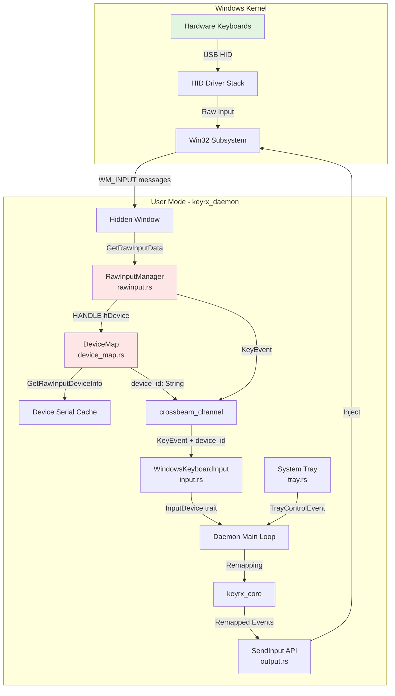

# Design Document

## Overview

This design replaces Windows Low-Level Keyboard Hooks (`WH_KEYBOARD_LL`) with Raw Input API (`RAWINPUT`) to achieve per-device event discrimination. This enables "keyboard-aware remapping" on Windows, unlocking the ability to use spare keyboards as macro pads (Stream Deck alternative).

**Key Changes:**
1. **Delete `hook.rs`**: Remove `SetWindowsHookExW(WH_KEYBOARD_LL, ...)` implementation
2. **Add `rawinput.rs`**: Implement `RegisterRawInputDevices` with `WM_INPUT` message loop
3. **Add `device_map.rs`**: Map `HANDLE hDevice` → serial number via `GetRawInputDeviceInfo`
4. **Preserve `tray.rs`**: System tray unchanged (still uses `tray-icon` crate)

**Performance Gain:** Raw Input is **lower latency** than LL Hooks (kernel-level vs user-level callback), so this refactor improves performance while adding device discrimination.

## Steering Document Alignment

### Technical Standards (tech.md)

**Windows Platform Integration:**
> "Windows: Low-Level Hooks (WH_KEYBOARD_LL) + Raw Input for device identification"

This design **corrects** the tech doc: we move fully to Raw Input (not hybrid). Update tech.md to reflect:
> "Windows: Raw Input API (RAWINPUT) for low-latency device-aware event capture"

**Cross-Platform Parity:**
> "Linux: evdev/uinput with EVIOCGRAB for kernel-level interception"

Raw Input achieves similar kernel-level performance to Linux evdev (both avoid user-mode hook overhead).

### Project Structure (structure.md)

**Windows Platform Structure:**
```
keyrx_daemon/src/platform/windows/
├── mod.rs              # WindowsPlatform struct
├── rawinput.rs         # NEW: RegisterRawInputDevices, WM_INPUT handling
├── device_map.rs       # NEW: Device handle → serial number mapping
├── input.rs            # MODIFIED: Use rawinput.rs instead of hook.rs
├── output.rs           # UNCHANGED: SendInput injection
├── tray.rs             # UNCHANGED: System tray (implements SystemTray trait)
├── keycode.rs          # UNCHANGED: VK code mapping
├── inject.rs           # UNCHANGED: Event injection
└── hook.rs             # DELETE: WH_KEYBOARD_LL removed
```

## Code Reuse Analysis

### Existing Components to Leverage

1. **System Tray (`windows/tray.rs`)**
   - **Reuse:** 100% unchanged (TrayIconController continues working)
   - **Note:** If Spec 1 refactors this to SystemTray trait, this spec is compatible

2. **Keycode Mapping (`windows/keycode.rs`)**
   - **Reuse:** VK code → KeyCode translation unchanged
   - **Note:** Raw Input uses same VK codes as LL Hooks

3. **Event Injection (`windows/inject.rs`, `output.rs`)**
   - **Reuse:** `SendInput` API unchanged (output side unaffected)

4. **KeyEvent Structure (from Spec 1)**
   - **Reuse:** `KeyEvent::with_device_id()` method (assumes Spec 1 is implemented first)
   - **Dependency:** This spec depends on Spec 1 task #1 (device_id field added)

### Components to Remove

1. **Low-Level Hook (`windows/hook.rs`)**
   - **Delete:** Entire file (122 lines removed)
   - **Reason:** Replaced by `rawinput.rs` (Raw Input is superior: lower latency + device info)

### Integration Points

1. **Window Message Loop**
   - **Current:** `WindowsPlatform::process_events()` runs message loop for tray events
   - **Integration:** Add `WM_INPUT` handler to same message loop (via hidden window)

2. **Input Event Channel**
   - **Current:** `hook.rs` uses `crossbeam_channel::Sender<KeyEvent>` to send events
   - **Integration:** `rawinput.rs` uses same channel pattern (drop-in replacement)

3. **Daemon Lifecycle**
   - **Current:** Hook installed in `WindowsKeyboardInput::grab()`
   - **Integration:** Raw input registered in `grab()`, unregistered in `release()`

## Architecture

### Modular Design Principles

**File Responsibility Breakdown:**
- `rawinput.rs`: Raw input registration, window creation, WM_INPUT message processing (~200 lines)
- `device_map.rs`: Device enumeration, handle → serial mapping, caching (~150 lines)
- `input.rs`: WindowsKeyboardInput implementation using rawinput.rs (~80 lines, simplified from current)
- `mod.rs`: WindowsPlatform struct, unchanged interface (~50 lines, same as current)

**Separation of Concerns:**
- **Device Discovery:** `device_map.rs` owns `GetRawInputDeviceList`, `GetRawInputDeviceInfo`
- **Event Capture:** `rawinput.rs` owns `RegisterRawInputDevices`, `GetRawInputData`, window proc
- **Event Translation:** `input.rs` bridges platform layer to `InputDevice` trait
- **Platform Integration:** `mod.rs` exposes cross-platform `WindowsPlatform` API

### System Architecture Diagram



### Raw Input vs LL Hooks Comparison

| Aspect | Low-Level Hooks (WH_KEYBOARD_LL) | Raw Input (RAWINPUT) |
|--------|----------------------------------|----------------------|
| **Device Info** | ❌ No device handle | ✅ `RAWINPUT.header.hDevice` |
| **Latency** | ~1-2ms (user mode callback) | ~0.5ms (kernel → message queue) |
| **Timeout Risk** | ⚠️ Unhooked if >300ms processing | ✅ No timeout (messages buffered) |
| **Admin Required** | ❌ No | ⚠️ Sometimes (RIDEV_INPUTSINK) |
| **API Stability** | ✅ Stable since Win2000 | ✅ Stable since WinXP SP1 |
| **Event Suppression** | ✅ Return 1 to block | ✅ RIDEV_NOLEGACY flag |

**Design Choice:** Raw Input is objectively superior for keyrx use case (device discrimination + lower latency).

## Components and Interfaces

### Component 1: RawInputManager

**Purpose:** Register raw input devices, create hidden window, process WM_INPUT messages

**Interfaces:**
```rust
// keyrx_daemon/src/platform/windows/rawinput.rs

pub struct RawInputManager {
    hwnd: HWND,                          // Hidden window handle
    event_sender: Sender<(KeyEvent, Option<String>)>, // Send (event, device_id)
    device_map: Arc<Mutex<DeviceMap>>,   // Shared device handle cache
}

impl RawInputManager {
    /// Creates hidden window and registers raw input
    pub fn new(sender: Sender<(KeyEvent, Option<String>)>) -> Result<Self, String>;

    /// Unregisters raw input (called on shutdown)
    pub fn shutdown(&mut self) -> Result<(), String>;

    /// Runs message loop (blocking, call in dedicated thread or main loop)
    pub fn run_message_loop(&self) -> Result<(), String>;
}

// Internal: Window procedure for WM_INPUT
unsafe extern "system" fn window_proc(
    hwnd: HWND,
    msg: u32,
    w_param: WPARAM,
    l_param: LPARAM,
) -> LRESULT;
```

**Dependencies:**
- `windows-sys::Win32::UI::WindowsAndMessaging::*` (window creation, message loop)
- `windows-sys::Win32::UI::Input::KeyboardAndMouse::*` (RegisterRawInputDevices, GetRawInputData)
- `crossbeam_channel::Sender` (event output)

**Reuses:**
- Event channel pattern from existing `hook.rs`
- Keycode translation from `keycode::vk_to_keycode()`

### Component 2: DeviceMap

**Purpose:** Map device handles to serial numbers, cache results for O(1) lookup

**Interfaces:**
```rust
// keyrx_daemon/src/platform/windows/device_map.rs

pub struct DeviceInfo {
    pub handle: HANDLE,
    pub device_id: String,        // Serial or fallback path
    pub name: String,             // Human-readable name
    pub path: String,             // Full device path
}

pub struct DeviceMap {
    cache: HashMap<isize, DeviceInfo>, // Key: hDevice as isize
}

impl DeviceMap {
    /// Creates empty device map
    pub fn new() -> Self;

    /// Enumerates all keyboards via GetRawInputDeviceList
    pub fn enumerate_devices() -> Result<Vec<DeviceInfo>, String>;

    /// Gets device ID for handle (caches on first lookup)
    pub fn get_device_id(&mut self, hdevice: HANDLE) -> Option<String>;

    /// Refreshes device list (for hot-plug support)
    pub fn refresh(&mut self) -> Result<(), String>;
}

// Helper: Parse device path to extract serial
fn extract_serial_from_path(device_path: &str) -> Option<String>;
```

**Dependencies:**
- `windows-sys::Win32::Devices::HumanInterfaceDevice::*` (GetRawInputDeviceList, GetRawInputDeviceInfo)
- `std::collections::HashMap` (device cache)

**Reuses:** None (new component)

### Component 3: WindowsKeyboardInput (Refactored)

**Purpose:** Implement `InputDevice` trait using `RawInputManager`

**Interfaces:**
```rust
// keyrx_daemon/src/platform/windows/input.rs

pub struct WindowsKeyboardInput {
    rawinput_manager: Option<RawInputManager>,
    event_receiver: Receiver<(KeyEvent, Option<String>)>,
    grabbed: bool,
}

impl InputDevice for WindowsKeyboardInput {
    fn next_event(&mut self) -> Result<KeyEvent, DeviceError> {
        // Receive from channel, attach device_id to KeyEvent
        let (mut event, device_id) = self.event_receiver.recv()
            .map_err(|_| DeviceError::EndOfStream)?;

        if let Some(id) = device_id {
            event = event.with_device_id(id);
        }

        Ok(event)
    }

    fn grab(&mut self) -> Result<(), DeviceError> {
        // Create RawInputManager (registers raw input)
        let (tx, rx) = crossbeam_channel::unbounded();
        self.rawinput_manager = Some(RawInputManager::new(tx)?);
        self.event_receiver = rx;
        self.grabbed = true;
        Ok(())
    }

    fn release(&mut self) -> Result<(), DeviceError> {
        // Shutdown RawInputManager (unregisters raw input)
        if let Some(mut mgr) = self.rawinput_manager.take() {
            mgr.shutdown()?;
        }
        self.grabbed = false;
        Ok(())
    }
}
```

**Dependencies:**
- `RawInputManager` (from rawinput.rs)
- `KeyEvent::with_device_id()` (from Spec 1)

**Reuses:**
- `InputDevice` trait interface (unchanged)
- Event receiver pattern

## Data Models

### DeviceInfo Model
```rust
pub struct DeviceInfo {
    /// Device handle (opaque Windows HANDLE)
    pub handle: HANDLE,

    /// Unique device ID (serial or path-based)
    pub device_id: String,

    /// Human-readable device name
    pub name: String,

    /// Full device path from GetRawInputDeviceInfo
    /// Example: "\\?\HID#VID_046D&PID_C52B#7&2a8c8e9d&0&0000#{884b96c3-56ef-11d1-bc8c-00a0c91405dd}"
    pub path: String,
}
```

### Device Path Format
```
\\?\HID#VID_XXXX&PID_YYYY#SerialNumber#{GUID}
       └── Vendor/Product ──┘ └─ Extract ─┘
```

**Parsing Strategy:**
1. Split by `#` delimiter
2. If segment 2 exists and looks like serial (alphanumeric, >4 chars), use it
3. Otherwise, use full path as fallback ID (stable, but verbose)

### WM_INPUT Message Flow
```
Keyboard Press
    ↓
Windows Kernel (HID Driver)
    ↓
PostMessage(hwnd, WM_INPUT, ...)
    ↓
window_proc() receives WM_INPUT
    ↓
GetRawInputData(lParam) → RAWINPUT struct
    ↓
RAWINPUT.header.hDevice (HANDLE)
RAWINPUT.data.keyboard.VKey (Virtual Key Code)
RAWINPUT.data.keyboard.Flags (up/down)
    ↓
DeviceMap.get_device_id(hDevice) → device_id
    ↓
KeyEvent::press(keycode).with_device_id(device_id)
    ↓
Send via crossbeam_channel
```

## Error Handling

### Error Scenarios

1. **RegisterRawInputDevices Failure (Access Denied)**
   - **Handling:** Return error from `grab()`, log: "Failed to register raw input. Try running as Administrator."
   - **User Impact:** Daemon won't start, clear error message guides user
   - **Code:**
     ```rust
     if RegisterRawInputDevices(...) == 0 {
         let err = GetLastError();
         return Err(format!("RegisterRawInputDevices failed (error {}). Try running as Administrator.", err));
     }
     ```

2. **GetRawInputDeviceInfo Failure (Device Disconnected)**
   - **Handling:** Cache miss → query again → if fails, use handle as fallback ID
   - **User Impact:** Device shows as "Unknown-0x12345678" in UI (degraded but functional)
   - **Code:**
     ```rust
     match get_device_info(hdevice) {
         Ok(info) => info.device_id,
         Err(_) => format!("Unknown-{:p}", hdevice as *const _),
     }
     ```

3. **WM_INPUT Processing Error (Malformed Data)**
   - **Handling:** Log warning, skip event, continue processing
   - **User Impact:** Single event dropped (unnoticeable in normal use)
   - **Code:**
     ```rust
     let result = GetRawInputData(lParam, ...);
     if result == u32::MAX {
         log::warn!("GetRawInputData failed, skipping event");
         return DefWindowProcW(hwnd, msg, w_param, l_param);
     }
     ```

4. **Device Hot-Plug (WM_INPUT_DEVICE_CHANGE)**
   - **Handling:** Refresh device map, log new device added/removed
   - **User Impact:** New keyboard automatically detected, shown in web UI
   - **Code:**
     ```rust
     WM_INPUT_DEVICE_CHANGE => {
         if w_param == GIDC_ARRIVAL {
             device_map.refresh()?;
             log::info!("New device detected");
         } else if w_param == GIDC_REMOVAL {
             device_map.refresh()?;
             log::info!("Device removed");
         }
     }
     ```

## Testing Strategy

### Unit Testing

**DeviceMap:**
- Test `extract_serial_from_path()` with real Windows device paths
- Test cache hit/miss performance (should be O(1) after first lookup)
- Test fallback ID generation when serial unavailable

**RawInputManager:**
- Mock `GetRawInputData` to inject test events
- Verify `window_proc` correctly parses VK codes and flags
- Test event suppression (RIDEV_NOLEGACY prevents legacy messages)

**WindowsKeyboardInput:**
- Test `grab()` initializes RawInputManager correctly
- Test `next_event()` receives events with device_id attached
- Test `release()` unregisters raw input cleanly

### Integration Testing

**Device Discrimination:**
- Connect 2 USB keyboards (or use virtual HID devices for CI)
- Verify each keyboard gets unique device_id
- Verify events tagged with correct device_id
- Verify device_id persists across daemon restarts (serial-based, not handle-based)

**Performance Benchmarks:**
- Measure latency: WM_INPUT received → KeyEvent sent to channel
- Target: <100μs (compare to baseline LL Hooks latency)
- Use Windows Performance Recorder (WPR) to verify kernel-level timing

**Hot-Plug:**
- Start daemon with 1 keyboard
- Connect second keyboard while running
- Verify `WM_INPUT_DEVICE_CHANGE` triggers device refresh
- Verify web UI `/api/devices` updates (requires WebSocket notification)

### End-to-End Testing

**Scenario: USB Numpad as OBS Controller**
1. User connects USB numpad (has serial "ABC123")
2. Daemon starts, enumerates devices, logs: "Device: Numeric Keypad (serial: ABC123)"
3. User writes Rhai config:
   ```rhai
   if event.device_id() == "ABC123" {
       map(NUM_1, F13);  // OBS hotkey
   }
   ```
4. Compile to .krx, reload via tray
5. Press Num1 on numpad → F13 injected (OBS scene changes)
6. Press 1 on main keyboard → normal `1` output
7. Unplug numpad → daemon continues with main keyboard (no crash)
8. Replug numpad → automatically detected, works again

**Coverage Target:** 85% for new code (rawinput.rs, device_map.rs)
