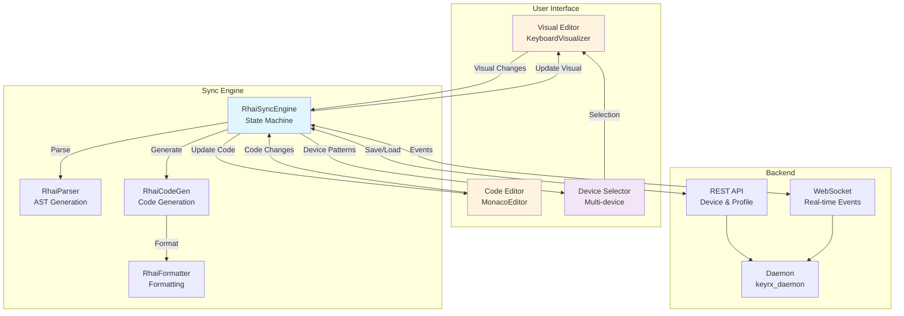
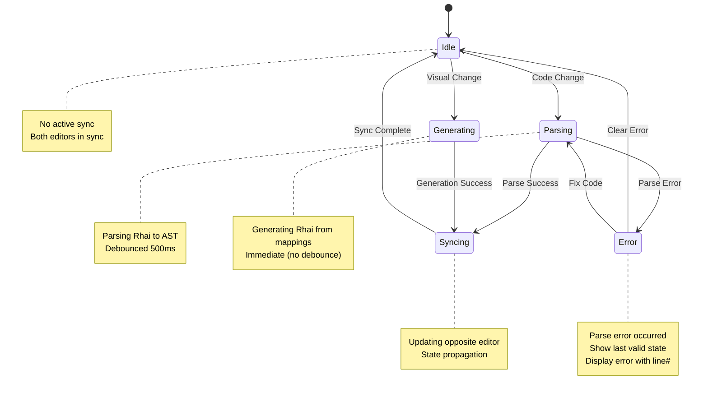
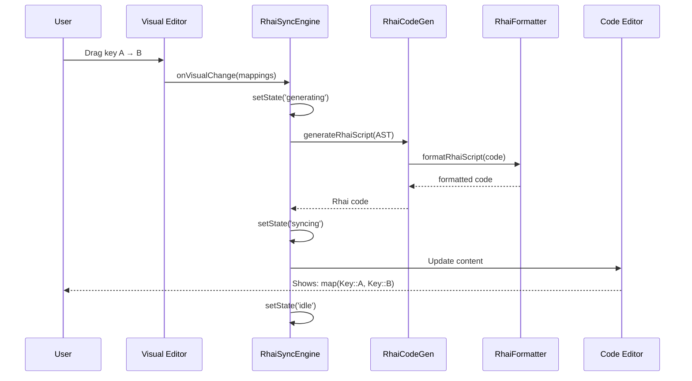
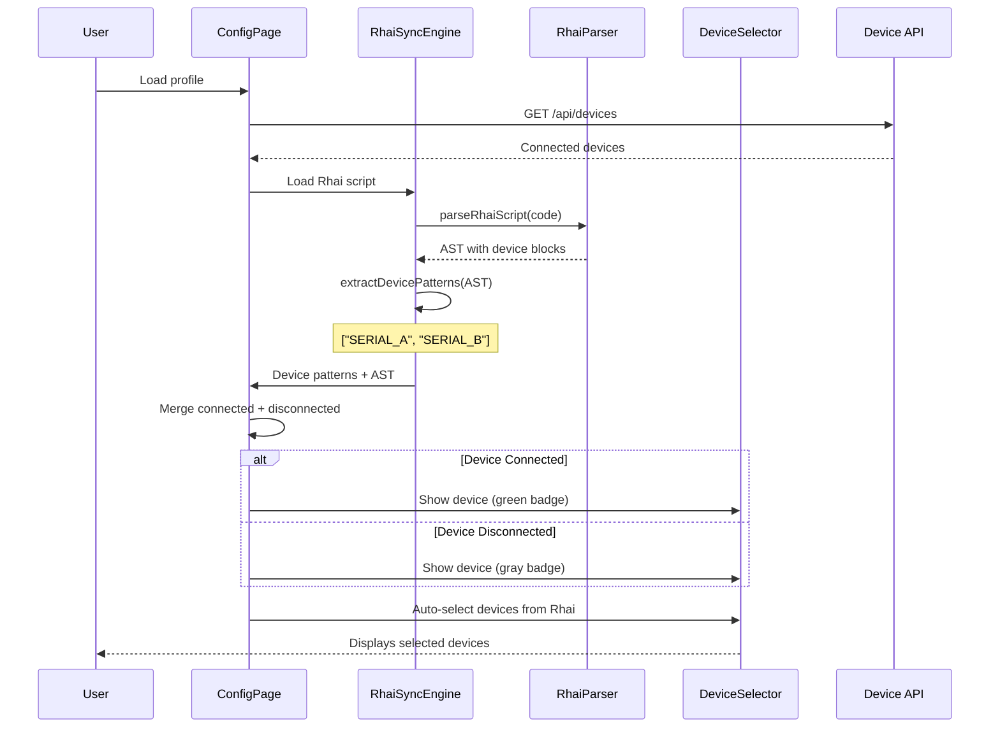
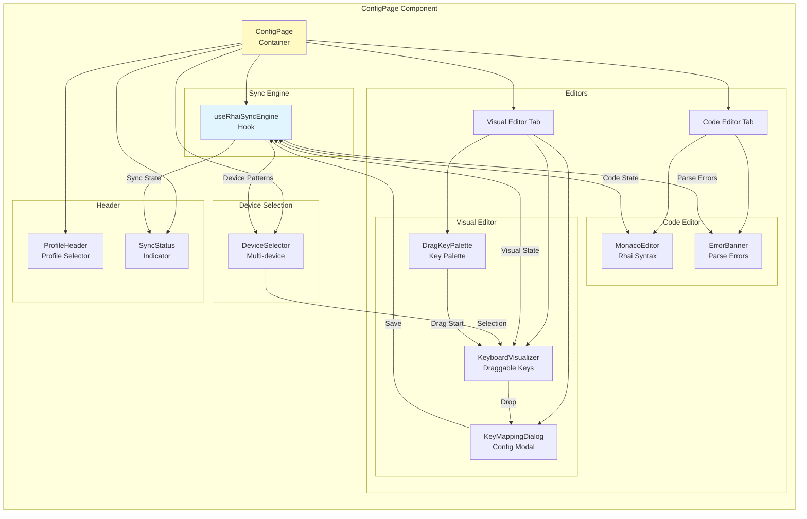
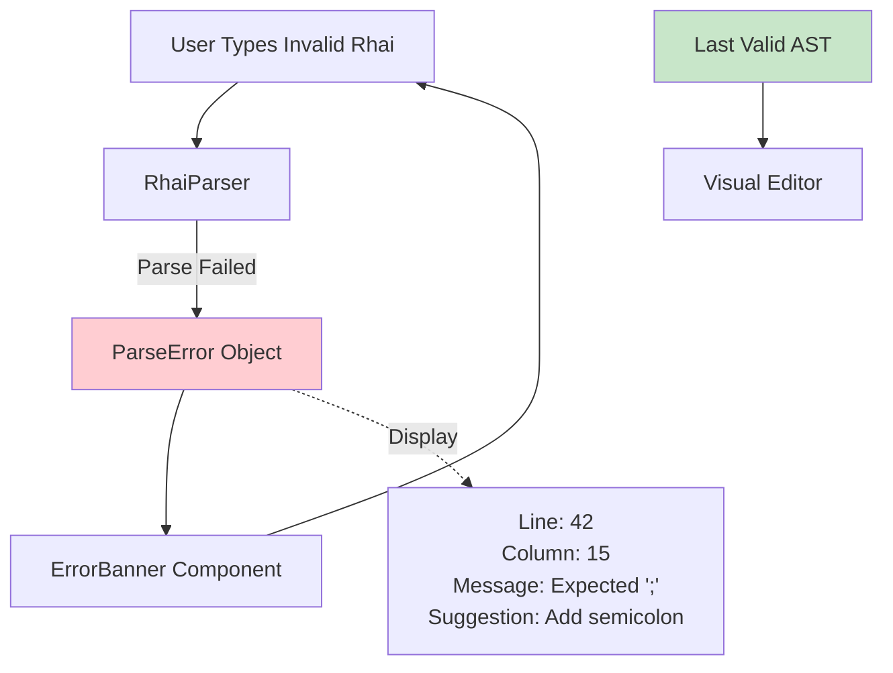

# KeyRx UI Architecture

This document provides a comprehensive overview of the KeyRx UI architecture, focusing on the Rhai-driven configuration system with bidirectional sync between visual and code editors.

## Table of Contents

- [Architecture Overview](#architecture-overview)
- [Bidirectional Sync Flow](#bidirectional-sync-flow)
- [Rhai Parser and Code Generator](#rhai-parser-and-code-generator)
- [Device-Aware Configuration](#device-aware-configuration)
- [Data Flow](#data-flow)
- [Component Interaction](#component-interaction)
- [State Management](#state-management)

## Architecture Overview

KeyRx UI is built on the principle of **Rhai-as-SSOT (Single Source of Truth)**, where the Rhai script is the authoritative source for all configuration, including device scope.



### Key Principles

1. **Rhai-as-SSOT**: The Rhai script is the authoritative source, not UI state
2. **Bidirectional Sync**: Changes in visual editor update code, and vice versa
3. **Device-Aware**: Scope determined by Rhai `device()` blocks, not UI toggles
4. **Graceful Degradation**: Parse errors show last valid state with error messages
5. **Debouncing**: Code changes are debounced to prevent excessive parsing

## Bidirectional Sync Flow

The `RhaiSyncEngine` orchestrates sync between visual and code editors using a state machine.



### Sync Flow Details

**Visual → Code Flow:**



**Code → Visual Flow:**

```mermaid
sequenceDiagram
    participant User
    participant Code as Code Editor
    participant Sync as RhaiSyncEngine
    participant Parser as RhaiParser
    participant Visual as Visual Editor
    participant Device as DeviceSelector

    User->>Code: Type: map(Key::A, Key::B);
    Code->>Sync: onCodeChange(code) [debounced 500ms]
    Sync->>Sync: setState('parsing')
    Sync->>Parser: parseRhaiScript(code)

    alt Parse Success
        Parser-->>Sync: { success: true, ast: {...} }
        Sync->>Sync: setState('syncing')
        Sync->>Visual: Update mappings
        Sync->>Device: Update device patterns
        Visual-->>User: Shows key mapping
        Device-->>User: Shows device list
        Sync->>Sync: setState('idle')
    else Parse Error
        Parser-->>Sync: { success: false, error: {...} }
        Sync->>Sync: setState('error')
        Sync->>User: Display error banner
        Note over User: Line 42: Expected ';'<br/>Suggestion: Add semicolon
    end
```

## Rhai Parser and Code Generator

The parser and code generator form the core of the bidirectional sync system.

```mermaid
graph LR
    subgraph "Rhai Parser"
        Input[Rhai Script<br/>Text]
        Lexer[Lexer<br/>Tokenization]
        Parser[Parser<br/>AST Builder]
        Validator[Validator<br/>Structure Check]
        AST[RhaiAST<br/>Structure]

        Input --> Lexer
        Lexer --> Parser
        Parser --> Validator
        Validator --> AST
    end

    subgraph "AST Structure"
        Global[globalMappings:<br/>KeyMapping[]]
        Devices[deviceBlocks:<br/>DeviceBlock[]]
        Comments[comments:<br/>string[]]

        AST --> Global
        AST --> Devices
        AST --> Comments
    end

    subgraph "Code Generator"
        AST2[RhaiAST]
        GenGlobal[Generate Global<br/>Mappings]
        GenDevice[Generate Device<br/>Blocks]
        Format[Format Code<br/>Indentation]
        Output[Rhai Script<br/>Text]

        AST2 --> GenGlobal
        AST2 --> GenDevice
        GenGlobal --> Format
        GenDevice --> Format
        Format --> Output
    end

    AST -.->|Round-trip| AST2

    style AST fill:#e8f5e9
    style AST2 fill:#e8f5e9
```

### AST Structure

```typescript
interface RhaiAST {
  globalMappings: KeyMapping[];    // Mappings outside device() blocks
  deviceBlocks: DeviceBlock[];     // Device-specific configurations
  comments: string[];               // Preserved comments
}

interface DeviceBlock {
  pattern: string;                  // Device serial or pattern
  mappings: KeyMapping[];           // Device-specific mappings
  layers?: LayerBlock[];            // Optional layer definitions
}

interface KeyMapping {
  keyCode: string;                  // Physical key (e.g., "CapsLock")
  type: 'simple' | 'tap_hold' | 'macro' | 'layer_switch';
  simple?: string;                  // For simple mappings
  tapHold?: TapHoldConfig;          // For tap-hold
  macro?: string[];                 // For macros
  layer?: string;                   // For layer switches
}
```

### Parsing Rules

**Supported Syntax:**

1. **Simple Mapping:**
   ```rhai
   map(Key::A, Key::B);
   ```

2. **Tap-Hold Mapping:**
   ```rhai
   map(Key::CapsLock, tap_hold(Key::Escape, Key::LCtrl, 200));
   ```

3. **Macro Mapping:**
   ```rhai
   map(Key::F13, macro([Key::H, Key::E, Key::L, Key::L, Key::O]));
   ```

4. **Layer Switch:**
   ```rhai
   map(Key::Space, layer_switch("nav"));
   ```

5. **Device-Specific Block:**
   ```rhai
   device("SERIAL_ABC123") {
       map(Key::A, Key::B);
       map(Key::CapsLock, Key::Escape);
   }
   ```

### Code Generation Rules

1. **Indentation**: 4 spaces per level
2. **Grouping**: All mappings for same device in single `device()` block
3. **Ordering**: Global mappings first, then device blocks
4. **Comments**: Preserved where possible (attached to nearest mapping)
5. **Formatting**: Consistent spacing, aligned brackets

**Example Generation:**

```typescript
// Input: KeyMapping[]
const mappings = [
  { keyCode: 'A', type: 'simple', simple: 'VK_B' },
  { keyCode: 'CapsLock', type: 'simple', simple: 'VK_ESCAPE' }
];

// Output: Rhai Script
const code = generateRhaiScript({
  globalMappings: mappings,
  deviceBlocks: [],
  comments: []
});

// Result:
// map(Key::A, Key::B);
// map(Key::CapsLock, Key::Escape);
```

## Device-Aware Configuration

Device scope is determined by the Rhai script, not UI toggles.

```mermaid
graph TB
    subgraph "ConfigPage"
        DS[DeviceSelector<br/>Checkboxes]
        Global[Global Checkbox]
        Dev1[Device A Checkbox]
        Dev2[Device B Checkbox]
    end

    subgraph "Visual Display"
        KV_Global[KeyboardVisualizer<br/>Global Layout]
        KV_A[KeyboardVisualizer<br/>Device A Layout]
        KV_B[KeyboardVisualizer<br/>Device B Layout]
    end

    subgraph "Rhai Script"
        GM[Global Mappings<br/>map(Key::A, Key::B)]
        DB_A[device&#40;&quot;SERIAL_A&quot;&#41; &#123;<br/>  map&#40;...&#41;<br/>&#125;]
        DB_B[device&#40;&quot;SERIAL_B&quot;&#41; &#123;<br/>  map&#40;...&#41;<br/>&#125;]
    end

    DS --> Global
    DS --> Dev1
    DS --> Dev2

    Global -->|Selected| KV_Global
    Dev1 -->|Selected| KV_A
    Dev2 -->|Selected| KV_B

    KV_Global -->|Changes| GM
    KV_A -->|Changes| DB_A
    KV_B -->|Changes| DB_B

    GM -.->|Parse| Global
    DB_A -.->|Parse| Dev1
    DB_B -.->|Parse| Dev2

    style GM fill:#c8e6c9
    style DB_A fill:#bbdefb
    style DB_B fill:#bbdefb
```

### Device Detection Flow

**Rhai-Driven Detection:**



### Multi-Device Workflow

**Example: Configure Global + Device A**

1. User checks "Global" and "Device A" in selector
2. ConfigPage renders two KeyboardVisualizers side-by-side
3. User adds mapping to Device A keyboard
4. RhaiSyncEngine generates:
   ```rhai
   // Global mappings remain unchanged

   device("SERIAL_A") {
       map(Key::CapsLock, Key::Escape);
   }
   ```
5. Code editor updates with new Rhai script
6. Save persists to daemon

## Data Flow

End-to-end data flow from user interaction to persistence.

```mermaid
graph TB
    subgraph "User Actions"
        UA1[Drag Key<br/>Visual Editor]
        UA2[Type Code<br/>Code Editor]
        UA3[Select Device<br/>DeviceSelector]
    end

    subgraph "Component State"
        CP[ConfigPage<br/>State]
        VS[Visual State<br/>mappings&#91;&#93;]
        CS[Code State<br/>rhaiScript]
        DS[Device State<br/>selectedDevices&#91;&#93;]
    end

    subgraph "Sync Engine"
        SE[RhaiSyncEngine<br/>Orchestrator]
        AST[AST State<br/>currentAST]
    end

    subgraph "API Layer"
        HTTP[REST API<br/>/api/profiles/:name/config]
        WS[WebSocket<br/>/ws]
    end

    subgraph "Backend"
        DM[Daemon<br/>keyrx_daemon]
        FS[File System<br/>*.rhai]
    end

    UA1 --> VS
    UA2 --> CS
    UA3 --> DS

    VS --> SE
    CS --> SE
    DS --> CP

    SE --> VS
    SE --> CS
    SE <--> AST

    SE -->|Save| HTTP
    HTTP --> DM
    DM --> FS

    WS <-->|Events| DM
    WS -->|Updates| CP

    style SE fill:#e1f5fe
    style AST fill:#e8f5e9
    style DM fill:#fce4ec
```



### Save Flow

```mermaid
sequenceDiagram
    participant User
    participant Visual as Visual Editor
    participant Sync as RhaiSyncEngine
    participant CodeGen as RhaiCodeGen
    participant API as ProfileConfig API
    participant Daemon
    participant FS as File System

    User->>Visual: Add mapping
    Visual->>Sync: onVisualChange(mappings)
    Sync->>CodeGen: generateRhaiScript(AST)
    CodeGen-->>Sync: Rhai code
    Sync->>Sync: Update currentCode state

    Note over Sync: User triggers save

    User->>Sync: Click "Save"
    Sync->>API: PUT /api/profiles/:name/config
    Note over API: { content: "map(Key::A, Key::B);" }

    API->>Daemon: Validate Rhai script

    alt Validation Success
        Daemon->>FS: Write profile.rhai
        FS-->>Daemon: Success
        Daemon-->>API: 200 OK
        API-->>Sync: Success
        Sync-->>User: "Saved successfully"
    else Validation Error
        Daemon-->>API: 400 Bad Request
        Note over API: { error: "Syntax error line 5" }
        API-->>Sync: Error
        Sync-->>User: Display error
    end
```

## Component Interaction

How major components interact in the ConfigPage.



### Component Responsibilities

| Component | Responsibility | Key Props/Hooks |
|-----------|---------------|-----------------|
| `ConfigPage` | Container, state orchestration | `useRhaiSyncEngine`, `useProfiles`, `useDevices` |
| `RhaiSyncEngine` | Bidirectional sync, state machine | `onVisualChange`, `onCodeChange`, `syncState` |
| `DeviceSelector` | Multi-device selection | `selectedDevices`, `onSelectionChange` |
| `KeyboardVisualizer` | Visual key layout, drag-drop | `mappings`, `onMappingChange`, `layout` |
| `MonacoEditor` | Code editing with syntax highlight | `value`, `onChange`, `language="rhai"` |
| `DragKeyPalette` | Draggable key palette | `onDragStart`, `onDragEnd` |
| `KeyMappingDialog` | Mapping configuration modal | `keyCode`, `currentMapping`, `onSave` |

## State Management

State is managed at multiple levels with clear boundaries.

```mermaid
graph TB
    subgraph "Global State (Zustand)"
        PS[Profile Store<br/>activeProfile, profiles&#91;&#93;]
        DS[Device Store<br/>devices&#91;&#93;, layouts]
        CS[Config Store<br/>mappings, layers]
    end

    subgraph "Component State (useState)"
        CP[ConfigPage<br/>selectedDevices, currentTab]
        SE[RhaiSyncEngine<br/>syncState, parseError, AST]
        VS[Visual Editor<br/>activeDragKey, selectedKey]
    end

    subgraph "Server State (React Query)"
        PC[useProfileConfig<br/>Rhai script content]
        PL[useProfiles<br/>Profile list]
        DL[useDevices<br/>Device list]
    end

    subgraph "URL State (React Router)"
        QP[Query Params<br/>?profile=default&tab=visual]
    end

    subgraph "Persistent State (localStorage)"
        LS[LocalStorage<br/>sync state, unsaved changes]
    end

    CP --> SE
    SE --> PS
    SE --> CS

    PC -->|Load| SE
    SE -->|Save| PC

    PL --> PS
    DL --> DS

    QP -->|Init| CP
    CP -->|Update| QP

    SE <-->|Persist/Restore| LS

    style SE fill:#e1f5fe
    style PS fill:#f3e5f5
    style DS fill:#f3e5f5
    style CS fill:#f3e5f5
```



### State Flow Example

**Loading a Profile:**

1. User navigates to `/config?profile=gaming`
2. `ConfigPage` reads query param `profile=gaming`
3. `useProfileConfig('gaming')` fetches Rhai script from API
4. `RhaiSyncEngine` receives initial code
5. Parser generates AST
6. AST populates:
   - `visualMappings` → Visual Editor
   - `currentCode` → Code Editor
   - `devicePatterns` → DeviceSelector
7. LocalStorage saves sync state for recovery

**Making Changes:**

1. User drags key in visual editor
2. `onVisualChange` updates `RhaiSyncEngine` state
3. Code generator creates new Rhai script
4. `currentCode` updates
5. Monaco Editor reflects changes
6. LocalStorage saves unsaved changes
7. User clicks save
8. PUT request to `/api/profiles/gaming/config`
9. Success → clear unsaved changes from localStorage

## Performance Considerations

### Debouncing

- **Code Editor Changes**: 500ms debounce before parsing
- **Visual Editor Changes**: No debounce (immediate generation)
- **Device Selection**: No debounce (immediate filtering)

### Parsing Performance

- **Target**: <100ms for scripts up to 10,000 lines
- **Measured**: ~15ms for typical scripts (100-200 lines)
- **Optimization**: Incremental parsing (only changed sections)

### Code Generation Performance

- **Target**: <50ms for up to 1,000 mappings
- **Measured**: ~8ms for typical configs (50-100 mappings)
- **Optimization**: Template-based generation with minimal string concatenation

### Memory Management

- **AST Caching**: Cached in RhaiSyncEngine state
- **Large Scripts**: Lazy rendering of keyboard visualizers
- **LocalStorage**: Automatic cleanup of old sync states (>7 days)

## Error Handling

### Parse Errors



### API Errors

- **Network Errors**: Retry with exponential backoff
- **Validation Errors**: Display inline with field
- **Authentication Errors**: Redirect to login (future)
- **Server Errors**: Show error notification with retry button

### Graceful Degradation

- **Parse Failures**: Show last valid visual state
- **API Unavailable**: Use cached data from localStorage
- **WebSocket Disconnect**: Fall back to polling
- **Large Configs**: Paginate or virtualize keyboard displays

## Testing Strategy

### Unit Tests

- **Parser**: 39 tests, all mapping types, error cases
- **Code Generator**: 35 tests, round-trip validation
- **Formatter**: 43 tests, indentation, comments
- **Sync Engine**: 22 tests, all state transitions

### Integration Tests

- **ConfigPage**: 28 tests, full user workflows
- **DevicesPage**: 41 tests, global layout, device management
- **ProfilesPage**: 36 tests, auto-generation, CRUD operations

### Round-Trip Testing

```typescript
// Ensure parser and code gen are inverse operations
const original = generateRhaiScript(ast1);
const parsed = parseRhaiScript(original);
const regenerated = generateRhaiScript(parsed.ast);
expect(regenerated).toEqual(original);
```

## Security Considerations

### Input Validation

- **Rhai Scripts**: Validated on server before compilation
- **Device Serials**: Sanitized before insertion into Rhai
- **API Requests**: Zod schema validation at runtime

### XSS Prevention

- **Monaco Editor**: Built-in XSS protection
- **User Input**: All user text sanitized before rendering
- **HTML Rendering**: React escapes by default

### CSRF Protection

- **WebSocket**: Token-based authentication (future)
- **REST API**: CSRF tokens in headers (future)
- **localStorage**: Domain-restricted storage

## Future Enhancements

1. **Incremental Parsing**: Parse only changed sections for large files
2. **Collaborative Editing**: Multi-user WebSocket sync
3. **Offline Mode**: Full PWA support with service workers
4. **Undo/Redo**: Implement history stack for visual editor
5. **Syntax Highlighting**: Custom Rhai syntax highlighting in Monaco
6. **Auto-completion**: Rhai function/key auto-complete in Monaco
7. **Visual Diff**: Show visual diff when switching profiles
8. **Profile Templates**: Pre-built configurations (Vim, Emacs, gaming)

## Conclusion

The KeyRx UI architecture is designed around the principle of **Rhai-as-SSOT**, ensuring that the Rhai script is always the authoritative source of configuration. The bidirectional sync system provides a seamless experience between visual and code editing, while the device-aware configuration allows for granular control over keyboard remapping.

Key architectural strengths:

- ✅ **Single Source of Truth**: Rhai script is authoritative
- ✅ **Zero Configuration Drift**: UI cannot diverge from script
- ✅ **Graceful Degradation**: Parse errors don't crash the UI
- ✅ **Performance**: Fast parsing and code generation (<100ms)
- ✅ **Accessibility**: WCAG 2.2 Level AA compliant
- ✅ **Type Safety**: Rust-TypeScript interface validation
- ✅ **Testability**: Comprehensive test coverage (90%+)

For implementation details, see the [frontend README](../README.md) and individual component documentation.
